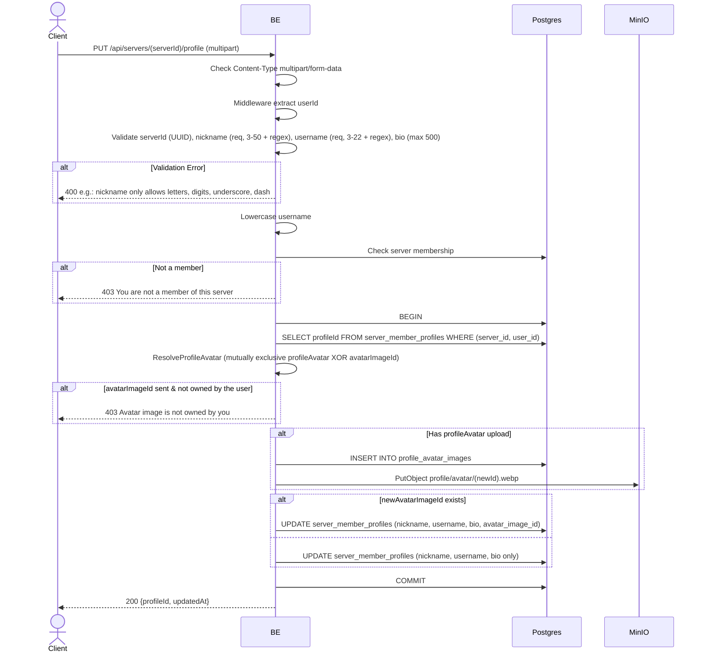

## Overview

This API is used to update a user's per-server profile. It can update nickname, username, bio, and avatar (new file OR reuse an existing `avatarImageId`). Avatar is mutually exclusive — send one, or neither (the existing avatar is kept). The request format is multipart.

Username unique per server (unique index `(server_id, username)`).

---

## Auth

This is a protected API, so it requires the authorization header `Bearer <accessToken>`.

## Flow



---

## Notes Redis

Does not use Redis.

---

## Notes MinIO

When uploading `profileAvatar`:
- Bucket: `MINIO_BUCKET_NAME`
- Object key: `profile/avatar/{newId}.webp`
- Content-Type: `image/webp`
- Action: PutObject

---

## Notes Postgres/DB

| Table                     | Column                                                      | Action | Notes                                       |
| ------------------------- | ----------------------------------------------------------- | ------ | ------------------------------------------- |
| `server_members`          | (count)                                                     | SELECT | Check membership                              |
| `server_member_profiles`  | id                                                          | SELECT | Fetch profileId                              |
| `profile_avatar_images`   | (full)                                                      | INSERT | When there is a `profileAvatar` upload         |
| `profile_avatar_images`   | id, created_by                                              | SELECT | Check ownership of `avatarImageId` (if sent) |
| `server_member_profiles`  | nickname, username, bio, [avatar_image_id], updated_at, updated_by | UPDATE | Update per-server profile                 |

---

## Prerequisites

The user is a member of the server. Has a row in `server_member_profiles` (automatically present due to copy-on-join).

---

## Request Validation

Path parameter:

| Field      | Type   | Required | Rules           |
| ---------- | ------ | -------- | --------------- |
| `serverId` | string | yes      | Required, UUID  |

Multipart body:

| Field           | Type          | Required | Rules                                                                          |
| --------------- | ------------- | -------- | ------------------------------------------------------------------------------- |
| `nickname`      | string        | yes      | Required, min 3, max 50, regex `^[a-zA-Z0-9_-]+$`                               |
| `username`      | string        | yes      | Required, min 3, max 22, regex `^[a-zA-Z0-9_.]+$` (auto-lowercase)              |
| `bio`           | string        | no       | Max 500 characters (trimmed; empty → NULL)                                       |
| `profileAvatar` | file          | no       | New image (jpg/jpeg/png/gif/webp), max 5MB. Mutually exclusive with `avatarImageId` |
| `avatarImageId` | string (UUID) | no       | Reuse existing `profile_avatar_images` UUID owned by the user. Mutually exclusive with `profileAvatar` |

---

## Response

### 200 OK

```json
{
  "profileId": "profile-uuid",
  "updatedAt": "2026-05-23T10:00:00Z"
}
```

### 400 Bad Request

| `error_message`                                                       | Cause                          |
| --------------------------------------------------------------------- | ------------------------------ |
| `Invalid Content-Type header. Endpoint requires multipart/form-data.` | Wrong Content-Type             |
| `serverId is not a valid UUID`                                        | Invalid UUID                    |
| `nickname is required`                                                | Nickname is empty               |
| `nickname must be at least 3 characters`                              | Nickname is less than 3         |
| `nickname must be at most 50 characters`                              | Nickname is more than 50        |
| `nickname only allows letters, digits, underscore, dash`              | Nickname fails regex             |
| `username is required`                                                | Username is empty               |
| `username must be at least 3 characters`                              | Username is less than 3         |
| `username must be at most 22 characters`                              | Username is more than 22        |
| `Username may only contain letters, digits, underscores and dots`     | Username fails regex             |
| `bio must be at most 500 characters`                                  | Bio is too long                 |
| `image size exceeded 5MB limit`                                       | profileAvatar > 5MB             |
| `invalid file extension: ...`                                         | Extension not allowed            |
| `invalid image type: ...`                                             | MIME type not allowed            |

### 403 Forbidden

| `error_message`                          | Cause                                   |
| ---------------------------------------- | --------------------------------------- |
| `You are not a member of this server`    | Not a member                             |
| `Avatar image is not owned by you`       | avatarImageId is not owned by the user   |

### 409 Conflict

The `UpdateServerProfileFull` / `UpdateServerProfileNickBioTx` repository catches SQL error `23505` and maps it to `ConflictError` (HTTP 409) per constraint name:

| `error_message`                              | Cause                                                                                   |
| -------------------------------------------- | --------------------------------------------------------------------------------------- |
| `Nickname is already taken in this server`   | Collision with unique index `idx_server_member_profiles_uk_02` (`server_id, nickname`) |
| `Username is already taken in this server`   | Collision with unique index `idx_server_member_profiles_uk_03` (`server_id, username`) |

### 401 Unauthorized

Standard auth errors.

---

## Update

This documentation was last updated on 23 May 2026.
