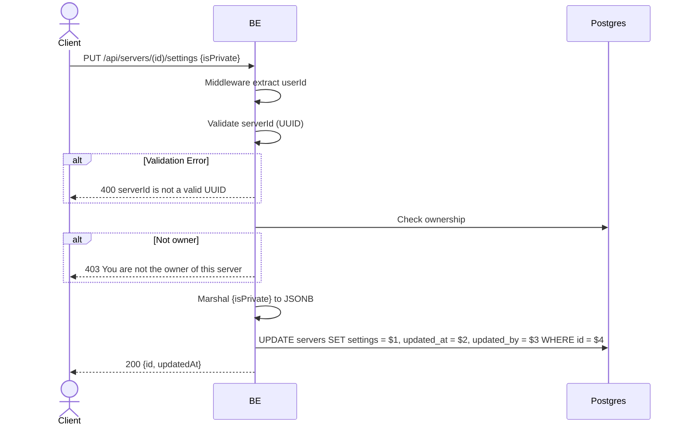

## Overview

This API is used to change the server settings. Currently the settings only contain `isPrivate` (boolean). Only the owner is allowed.

---

## Auth

This is a protected API, so it requires the authorization header `Bearer <accessToken>`.

## Flow



---

## Notes Redis

Does not use Redis.

---

## Notes Postgres/DB

| Table     | Column     | Action | Notes                   |
| --------- | ---------- | ------ | ----------------------- |
| `servers` | owner_id   | SELECT | Check ownership         |
| `servers` | settings   | UPDATE | Set new JSONB settings  |
| `servers` | updated_at | UPDATE | UTC now                 |
| `servers` | updated_by | UPDATE | userId                  |

---

## Prerequisites

The user is the server owner.

---

## Request Validation

| Field       | Type   | Required | Rules           |
| ----------- | ------ | -------- | --------------- |
| `id` (path) | string | yes      | Required, UUID  |
| `isPrivate` | bool   | no       | Default `false` |

---

## Response

### 200 OK

```json
{
  "id": "uuid",
  "updatedAt": "2026-05-23T10:00:00Z"
}
```

### 400 Bad Request

| `error_message`                | Cause           |
| ------------------------------ | --------------- |
| `serverId is not a valid UUID` | Invalid UUID    |

### 403 Forbidden

| `error_message`                          | Cause        |
| ---------------------------------------- | ------------ |
| `You are not the owner of this server`   | Not owner    |

### 401 Unauthorized

Standard auth errors.

---

## Update

This documentation was last updated on 23 May 2026.
