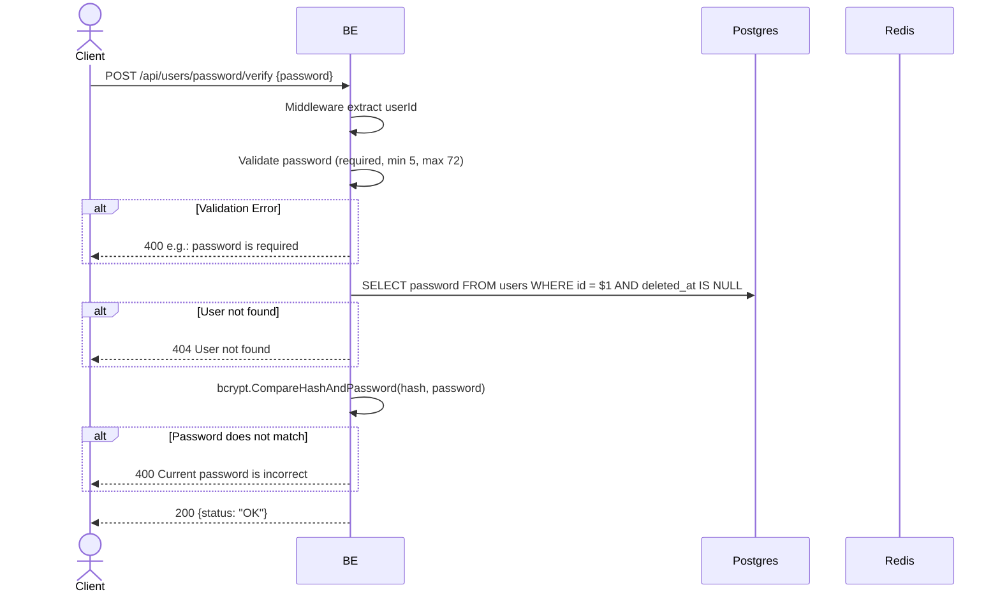

## Overview

This API is used to verify the user's current password. This endpoint is step 1 of the change-password flow in the frontend (before the user enters the new password). It does not make any changes to the database.

---

## Auth

This is a protected API, so it requires the authorization header `Bearer <accessToken>`.

## Flow



---

## Notes Redis

This endpoint does not access Redis (other than the auth-check middleware).

---

## Notes Postgres/DB

| Table   | Column   | Action | Notes                                 |
| ------- | -------- | ------ | ------------------------------------- |
| `users` | password | SELECT | Fetch the password hash for comparison |

---

## Prerequisites

The user is already logged in with a valid access token.

---

## Request Validation

| Field      | Type   | Required | Rules                                     |
| ---------- | ------ | -------- | ----------------------------------------- |
| `password` | string | yes      | Required, min 5 characters, max 72 characters |

---

## Response

### 200 OK

```json
{
  "status": "OK"
}
```

### 400 Bad Request

| `error_message`                          | Cause                          |
| ---------------------------------------- | ------------------------------ |
| `password is required`                   | Password is empty              |
| `password must be at least 5 characters` | Password is less than 5 characters |
| `password must be at most 72 characters` | Password is more than 72 characters |
| `Current password is incorrect`          | Password does not match the hash |

### 401 Unauthorized

| `error_message`                              | Cause                                   |
| -------------------------------------------- | --------------------------------------- |
| `Authorization header is missing`            | Header is missing                       |
| `Authentication token is invalid`            | JWT invalid                              |
| `Authorization token not found or expired`   | Token is not in the Redis cache          |

### 404 Not Found

| `error_message`    | Cause                          |
| ------------------ | ------------------------------ |
| `User not found`   | User does not exist / soft-deleted  |

---

## Update

This documentation was last updated on 23 May 2026.
