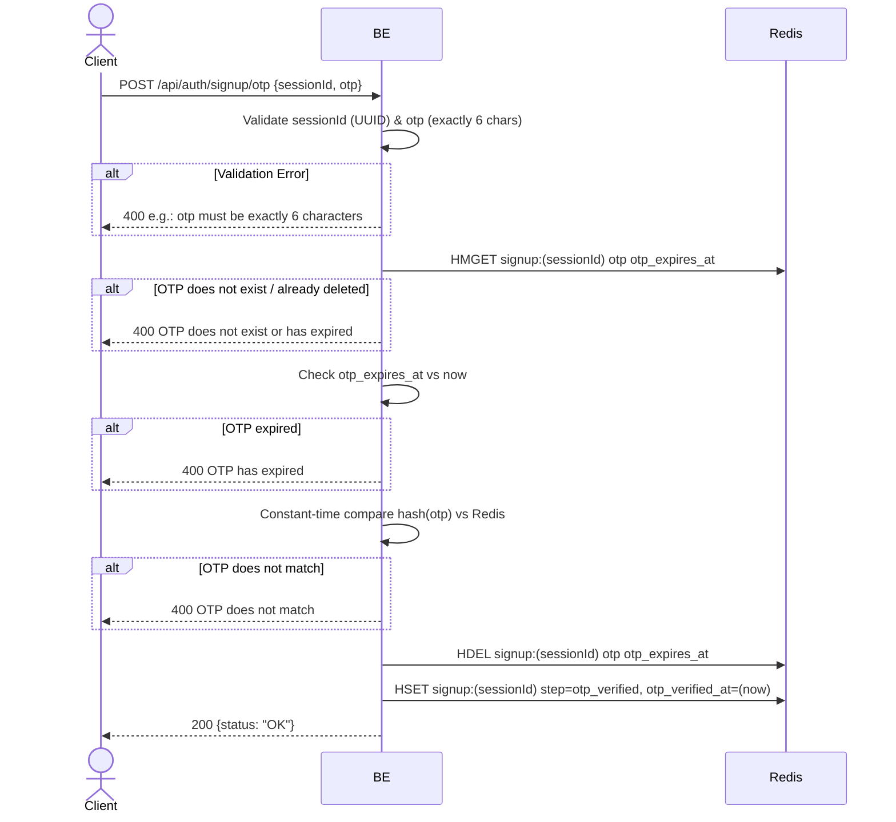

## Overview

This API is used to verify the OTP sent to the email during signup. The backend checks the OTP hash, expiry, then updates the session step to `otp_verified`.

---

## Auth

This is a public API, so no authorization header is required. But it needs a valid `sessionId` from the `start_signup` step.

## Flow



---

## Notes Redis

1. signup session:
   key: `signup:(sessionId)`
   type: HASH

| Field             | Type   | Action | Notes                                            |
| ----------------- | ------ | ------ | ------------------------------------------------ |
| `otp`             | string | HDEL   | OTP hash is deleted after successful verification |
| `otp_expires_at`  | string | HDEL   | Expiry timestamp is deleted after verification    |
| `step`            | string | HSET   | Updated to `otp_verified`                        |
| `otp_verified_at` | string | HSET   | Unix timestamp of the successful verification     |

---

## Notes Postgres/DB

This endpoint does not access Postgres.

---

## Prerequisites

The user must have already hit `start_signup` and have an active `sessionId` in Redis. The OTP sent to the email must not be expired yet (OTP TTL 5 minutes).

---

## Request Validation

| Field       | Type   | Required | Rules                                 |
| ----------- | ------ | -------- | ------------------------------------- |
| `sessionId` | string | yes      | Required, must be a valid UUID        |
| `otp`       | string | yes      | Required, exactly 6 characters        |

---

## Response

### 200 OK

```json
{
  "status": "OK"
}
```

### 400 Bad Request

| `error_message`                       | Cause                                          |
| ------------------------------------- | ---------------------------------------------- |
| `sessionId is required`               | sessionId is empty                             |
| `sessionId is not a valid UUID`       | sessionId is not in UUID format                |
| `otp is required`                     | OTP is empty                                   |
| `otp must be exactly 6 characters`    | OTP length is not 6 characters                 |
| `OTP does not exist or has expired`   | OTP is no longer in Redis (TTL elapsed / deleted) |
| `OTP has expired`                     | The `otp_expires_at` field has passed          |
| `OTP does not match`                  | The user's OTP hash does not match the stored one |

---

## Update

This documentation was last updated on 23 May 2026.
