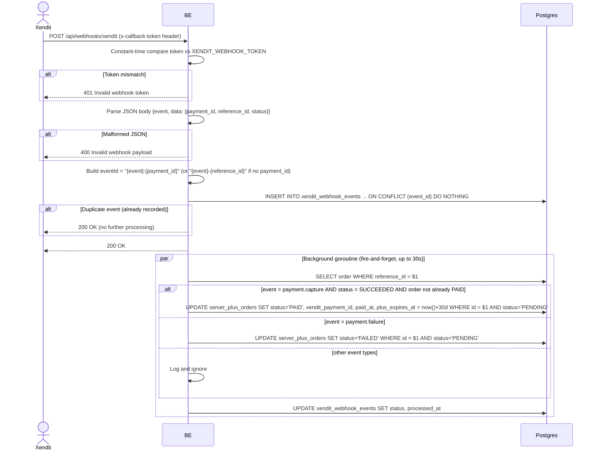

## Overview

This API is the webhook callback Xendit calls to report payment events (e.g. a successful or failed payment capture for a Virdan Plus checkout session). It is not called by the app's own clients. The request is authenticated by a shared secret callback token instead of a user access token, and the actual order-status update happens asynchronously in a background goroutine after the endpoint responds `200 OK`.

---

## Auth

This is a **public** endpoint (no `Authorization` bearer token, no membership/ownership checks). Instead it validates the `x-callback-token` header against `XENDIT_WEBHOOK_TOKEN` using a constant-time comparison.

## Flow



---

## Notes Redis

Does not use Redis.

---

## Notes Postgres/DB

| Table                    | Column                                                            | Action | Notes                                                                |
| ------------------------- | ---------------------------------------------------------------------- | ------ | --------------------------------------------------------------------------- |
| `xendit_webhook_events`  | id, event_id, event_type, reference_id, payload, status, received_at   | INSERT | Idempotency guard, `ON CONFLICT (event_id) DO NOTHING`; a duplicate delivery inserts 0 rows and processing is skipped |
| `server_plus_orders`     | (lookup)                                                                | SELECT | Fetch the order by `reference_id` (async, in the background goroutine)       |
| `server_plus_orders`     | status, xendit_payment_id, paid_at, plus_expires_at                    | UPDATE | Only applied `WHERE status = 'PENDING'`, so an already-`PAID`/`FAILED` order is left untouched |
| `xendit_webhook_events`  | status, processed_at                                                    | UPDATE | Marks the event `PROCESSED` or `FAILED` once the background handler finishes |

---

## Prerequisites

Caller must present the correct `x-callback-token` header (shared secret, configured out-of-band with Xendit — not a user credential).

---

## Request Validation

Header:

| Field              | Required | Rules                                     |
| -------------------- | -------- | -------------------------------------------- |
| `x-callback-token`  | yes      | Must match `XENDIT_WEBHOOK_TOKEN` exactly (constant-time comparison) |

Body (JSON):

| Field              | Type   | Required | Notes                                                          |
| -------------------- | ------ | -------- | ------------------------------------------------------------------- |
| `event`              | string | yes      | e.g. `payment.capture`, `payment.failure`; other values are logged and ignored |
| `data.payment_id`    | string | no       | Xendit's payment id; used to build the idempotency key together with `event` |
| `data.reference_id`  | string | yes*     | Must match the `reference_id` stored on the order (`virdan-plus-{orderId}`) for the update to find it |
| `data.status`        | string | no       | For `payment.capture`, must be `SUCCEEDED` for the order to be marked `PAID` |

\* Not validated for presence by the handler itself, but required in practice — if it doesn't match any order, the background lookup fails and the event is marked `FAILED` (silently, from Xendit's point of view, since the HTTP response was already `200 OK`).

---

## Response

### 200 OK

```json
{ "status": "OK" }
```

Returned both for a freshly accepted event (processing happens afterward, asynchronously) and for a duplicate delivery of an event already recorded (no reprocessing).

### 400 Bad Request

| `error_message`             | Cause                          |
| ------------------------------ | ---------------------------------- |
| `Invalid webhook payload`      | Body is not valid JSON              |

### 401 Unauthorized

| `error_message`           | Cause                                        |
| ---------------------------- | ------------------------------------------------- |
| `Invalid webhook token`      | Missing or incorrect `x-callback-token` header      |

---

## Update

This documentation was last updated on 20 July 2026.
