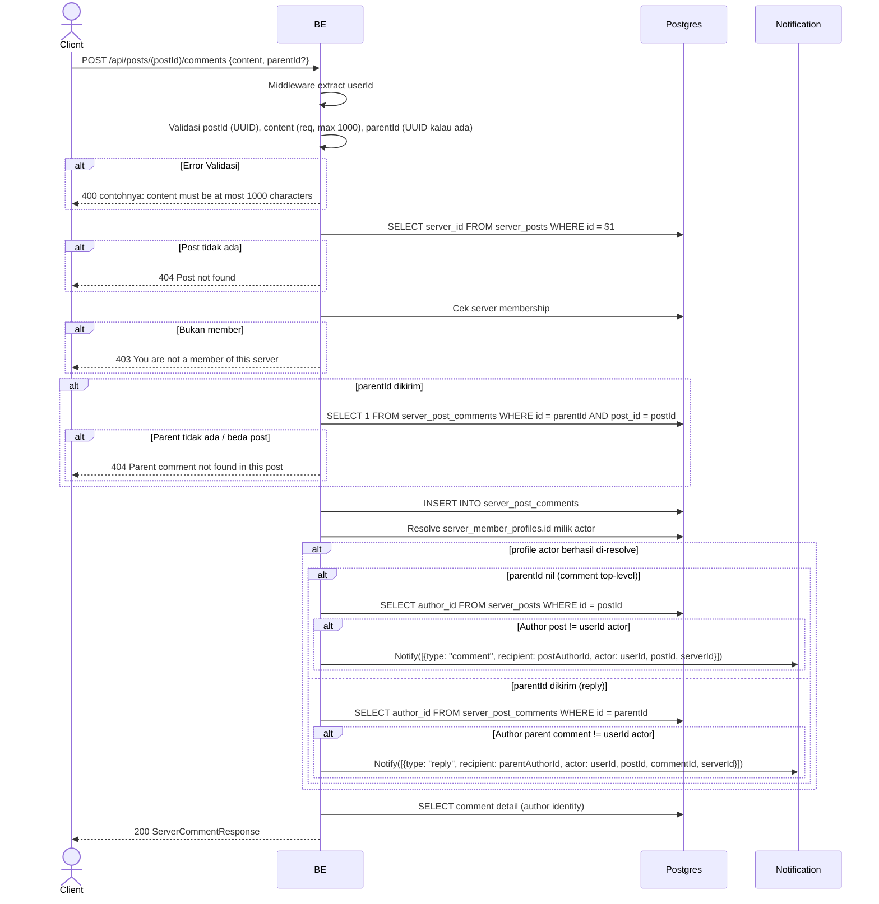

## Overview

API ini digunakan untuk membuat comment pada post. Bisa juga reply comment lain dengan kirim `parentId` (UUID comment parent). User harus member server. Kalau sukses, push notification dikirim ke recipient yang relevan — author post untuk comment top-level, atau author dari parent comment untuk reply — tapi hanya kalau recipient tersebut adalah user yang berbeda dari yang komentar (tidak ada self-notification).

---

## Auth

API ini adalah api protected jadi perlu authorization header `Bearer <accessToken>`.

## Flow



---

## Notes Redis

Tidak pakai Redis.

---

## Notes Postgres/DB

| Tabel                    | Kolom                                        | Aksi   | Keterangan                              |
| ------------------------ | -------------------------------------------- | ------ | --------------------------------------- |
| `server_posts`           | server_id                                    | SELECT | Ambil server_id                          |
| `server_members`         | (count)                                      | SELECT | Cek membership                           |
| `server_post_comments`   | (count)                                      | SELECT | Cek parent valid (kalau parentId dikirim) |
| `server_post_comments`   | id, post_id, author_id, parent_id, content   | INSERT | Comment baru                              |
| `server_member_profiles` | (profile id)                                 | SELECT | Resolve profile id actor untuk notifikasi |
| `server_posts`           | author_id                                    | SELECT | Resolve author post (hanya untuk notifikasi comment top-level) |
| `server_post_comments`   | author_id                                    | SELECT | Resolve author parent comment (hanya untuk notifikasi reply) |
| `server_member_profiles` | nickname, username, avatar_image_id          | SELECT | Author identity di server                 |

Catatan: notifikasi di-skip kalau recipient (author post atau author parent comment) adalah user yang sama dengan yang komentar.

---

## Prerequisites

User adalah member server tempat post berada. Bila reply, parent comment harus exists di post yang sama.

---

## Validasi Request

Path parameter:

| Field    | Tipe   | Wajib | Aturan          |
| -------- | ------ | ----- | --------------- |
| `postId` | string | ya    | Required, UUID  |

Body JSON:

| Field      | Tipe          | Wajib | Aturan                                    |
| ---------- | ------------- | ----- | ----------------------------------------- |
| `content`  | string        | ya    | Required, max 1000 karakter               |
| `parentId` | string (UUID) | tidak | Kalau diisi, harus UUID + parent harus exist di post yang sama |

---

## Response

### 200 OK

```json
{
  "id": "comment-uuid",
  "postId": "post-uuid",
  "parentId": null,
  "content": "Mantap!",
  "author": {
    "userId": "user-uuid",
    "nickname": "GamerX",
    "username": "gamerx",
    "avatarUrl": "http://.../webp",
    "status": "active"
  },
  "isOwner": true,
  "createdAt": "2026-05-23T10:00:00Z",
  "updatedAt": "2026-05-23T10:00:00Z"
}
```

### 400 Bad Request

| `error_message`                              | Penyebab                       |
| -------------------------------------------- | ------------------------------ |
| `postId is not a valid UUID`                 | postId invalid                  |
| `content is required`                        | Content kosong                  |
| `content must be at most 1000 characters`    | Content terlalu panjang         |
| `parentId is not a valid UUID`               | parentId bukan UUID             |

### 403 Forbidden

| `error_message`                          | Penyebab     |
| ---------------------------------------- | ------------ |
| `You are not a member of this server`    | Bukan member  |

### 404 Not Found

| `error_message`                                 | Penyebab                                |
| ----------------------------------------------- | --------------------------------------- |
| `Post not found`                                | Post tidak ada                          |
| `Parent comment not found in this post`         | parentId tidak ada / parent beda post   |

### 401 Unauthorized

Standard auth errors.

---

## Update

Dokumentasi ini diupdate tanggal 20 Juli 2026.
