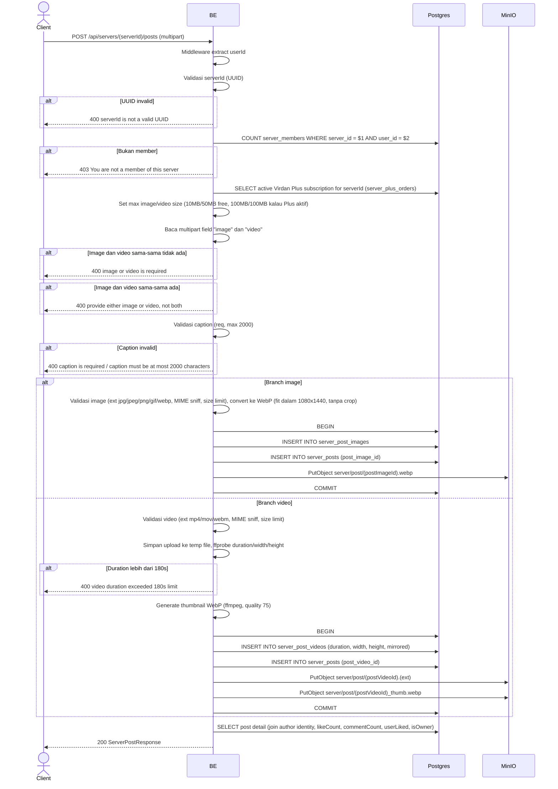

## Overview

API ini digunakan untuk membuat post di server tertentu. Format request multipart; kamu harus provide **salah satu** dari `image` **atau** `video` (tidak boleh dua-duanya, tidak boleh kosong dua-duanya). Image di-convert ke WebP; video di-probe untuk duration/dimension dan otomatis dibuatkan thumbnail WebP. Hanya member server yang boleh posting. Subscription Virdan Plus aktif di server menaikkan limit ukuran upload (tidak menghalangi member non-Plus untuk posting).

---

## Auth

API ini adalah api protected jadi perlu authorization header `Bearer <accessToken>`.

## Flow



---

## Notes Redis

Tidak pakai Redis (selain middleware auth check).

---

## Notes MinIO

- Bucket: `MINIO_BUCKET_NAME`
- Image object key: `server/post/{postImageId}.webp`, Content-Type `image/webp`
- Video object key: `server/post/{postVideoId}{ext}` (`.mp4`, `.mov`, atau `.webm`), Content-Type `video/mp4` / `video/quicktime` / `video/webm`
- Video thumbnail object key: `server/post/{postVideoId}_thumb.webp`, Content-Type `image/webp`
- Aksi: PutObject

---

## Notes Postgres/DB

| Tabel                 | Kolom                                                 | Aksi   | Keterangan                                                       |
| --------------------- | ------------------------------------------------------ | ------ | ------------------------------------------------------------------ |
| `server_members`      | (count)                                                | SELECT | Cek apakah user member                                              |
| `server_plus_orders`  | plus_expires_at, status                                | SELECT | Cek apakah server punya subscription Virdan Plus aktif (`status = 'PAID' AND plus_expires_at > now`) |
| `server_post_images`  | id, bucket, object_key, mime_type, size, width, height | INSERT | Image row (branch image saja)                                       |
| `server_post_videos`  | id, bucket, object_key, mime_type, size, duration, width, height, thumbnail_object_key, mirrored | INSERT | Video row (branch video saja)                                       |
| `server_posts`        | id, server_id, author_id, post_image_id/post_video_id, caption | INSERT | Post row                                                             |

---

## Prerequisites

User adalah member server target. Punya tepat satu file media valid (image atau video, tidak boleh dua-duanya).

---

## Validasi Request

Path parameter:

| Field      | Tipe   | Wajib | Aturan          |
| ---------- | ------ | ----- | --------------- |
| `serverId` | string | ya    | Required, UUID  |

Multipart body:

| Field     | Tipe    | Wajib               | Aturan                                                                                  |
| --------- | ------- | -------------------- | --------------------------------------------------------------------------------------- |
| `image`   | file    | salah satu image/video | Image (jpg/jpeg/png/gif/webp), max 10MB (free) / 100MB (server punya Virdan Plus aktif) |
| `video`   | file    | salah satu image/video | Video (mp4/mov/webm), max 50MB (free) / 100MB (server punya Virdan Plus aktif), max duration 180s |
| `mirror`  | string  | tidak                | `"true"` untuk flag video sebagai mirrored; diabaikan untuk post image                    |
| `caption` | string  | ya                   | Required, max 2000 karakter                                                              |

---

## Response

### 200 OK

Post image:

```json
{
  "id": "post-uuid",
  "serverId": "server-uuid",
  "caption": "Hello world!",
  "imageUrl": "http://.../server/post/imageId.webp",
  "mediaType": "image",
  "mediaWidth": 1080,
  "mediaHeight": 1350,
  "author": {
    "userId": "user-uuid",
    "nickname": "GamerX",
    "username": "gamerx",
    "avatarUrl": "http://.../profile/avatar/uuid.webp",
    "status": "active"
  },
  "likeCount": 0,
  "commentCount": 0,
  "userLiked": false,
  "userSaved": false,
  "isOwner": true,
  "createdAt": "2026-05-23T10:00:00Z",
  "updatedAt": "2026-05-23T10:00:00Z"
}
```

Post video tambahan punya field `videoUrl`, `thumbnailUrl`, `mediaType: "video"`, dan `mirrored` menggantikan `imageUrl`.

### 400 Bad Request

| `error_message`                              | Penyebab                          |
| -------------------------------------------- | ------------------------------ |
| `serverId is not a valid UUID`               | UUID invalid                    |
| `image or video is required`                 | Kedua file tidak ada            |
| `provide either image or video, not both`    | Kedua file ada                   |
| `image size exceeded 10MB limit` (atau 100MB kalau Plus aktif) | File image kelebihan ukuran      |
| `invalid file extension: ...`                | Ekstensi image tidak diizinkan   |
| `invalid image type: ...`                    | MIME type image tidak diizinkan  |
| `video size exceeded 50MB limit` (atau 100MB kalau Plus aktif) | File video kelebihan ukuran      |
| `invalid video extension: ...`               | Ekstensi video tidak diizinkan   |
| `invalid video type: ...`                    | MIME type video tidak diizinkan  |
| `video duration exceeded 180s limit`         | Video lebih dari 180 detik        |
| `caption is required`                        | Caption kosong                  |
| `caption must be at most 2000 characters`    | Caption terlalu panjang         |

### 403 Forbidden

| `error_message`                          | Penyebab                |
| ---------------------------------------- | ----------------------- |
| `You are not a member of this server`    | User bukan member server |

### 401 Unauthorized

Standard auth errors.

---

## Update

Dokumentasi ini diupdate tanggal 20 Juli 2026.
