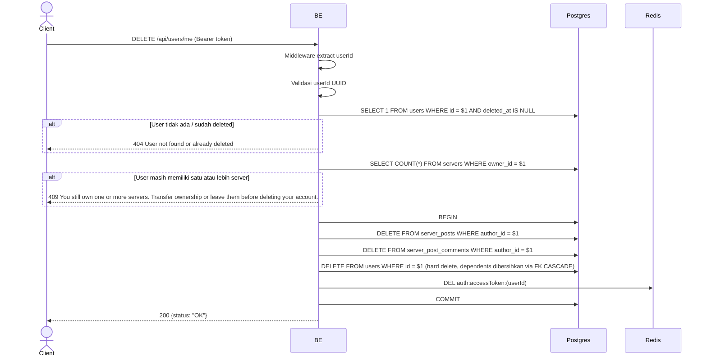

## Overview

API ini digunakan untuk menghapus permanen akun user yang sedang login. Backend akan:
1. Cek user masih ada (belum di-delete sebelumnya).
2. Cek user tidak memiliki server apapun (`servers.owner_id` punya FK `ON DELETE RESTRICT` ke `users`) — kalau user masih memiliki server, penghapusan ditolak dengan 409 supaya user bisa transfer ownership atau leave dulu.
3. Hard-delete post dan comment milik user (`server_posts.author_id` / `server_post_comments.author_id` adalah `ON DELETE RESTRICT`, jadi harus dihapus dulu sebelum row user itu sendiri bisa dihapus).
4. Hard-delete row `users` itu sendiri. Semua row lain yang mereferensikan user (`refresh_tokens`, `server_members`, `server_member_profiles`, `server_post_likes`, `server_post_saves`, `device_tokens`, `notifications`, `dm_conversations`, dll.) otomatis dibersihkan oleh FK `ON DELETE CASCADE`.
5. Clear access token cache di Redis.

Object di MinIO (avatar, gambar/video post) sengaja dibiarkan orphan (cleanup ditangani terpisah, bukan oleh endpoint ini).

---

## Auth

API ini adalah api protected jadi perlu authorization header `Bearer <accessToken>`.

## Flow



---

## Notes Redis

1. auth access token:
   key: `auth:accessToken:(userId)`
   aksi: DEL

---

## Notes Postgres/DB

| Tabel                   | Kolom     | Aksi   | Keterangan                                                                  |
| ----------------------- | --------- | ------ | ---------------------------------------------------------------------------- |
| `users`                 | id        | SELECT | Cek user aktif (`deleted_at IS NULL`)                                       |
| `servers`               | owner_id  | SELECT | Hitung jumlah server milik user (harus 0 supaya bisa lanjut)                |
| `server_posts`          | author_id | DELETE | Hard-delete post milik user (wajib: FK-nya `ON DELETE RESTRICT`)            |
| `server_post_comments`  | author_id | DELETE | Hard-delete comment milik user (wajib: FK-nya `ON DELETE RESTRICT`)         |
| `users`                 | id        | DELETE | Hard-delete row user itu sendiri                                            |

Menghapus row `users` akan cascade (`ON DELETE CASCADE`) ke `refresh_tokens`, `server_members`, `server_member_profiles`, `server_post_likes`, `server_post_saves`, `device_tokens`, `notifications`, dan `dm_conversations`/`dm_messages`, antara lain — semua ini tidak dihapus lewat query eksplisit oleh endpoint ini.

---

## Prerequisites

User sudah login dan punya access token valid. User tidak boleh sedang memiliki server apapun.

---

## Validasi Request

Endpoint tidak menerima body. Otentikasi via header.

---

## Response

### 200 OK

```json
{
  "status": "OK"
}
```

### 401 Unauthorized

| `error_message`                       | Penyebab                |
| ------------------------------------- | ----------------------- |
| `Authorization header is missing`     | Header tidak ada        |
| `Authentication token is expired`    | JWT expired             |
| `Authentication token is invalid`    | JWT invalid             |

### 404 Not Found

| `error_message`                       | Penyebab                                |
| ------------------------------------- | ---------------------------------------- |
| `User not found or already deleted`   | User sudah dihapus sebelumnya            |

### 409 Conflict

| `error_message`                                                                                          | Penyebab                                |
| ----------------------------------------------------------------------------------------------------------- | ---------------------------------------- |
| `You still own one or more servers. Transfer ownership or leave them before deleting your account.`     | `CountServersOwnedByUser` mengembalikan > 0 |

---

## Update

Dokumentasi ini diupdate tanggal 20 Juli 2026.
