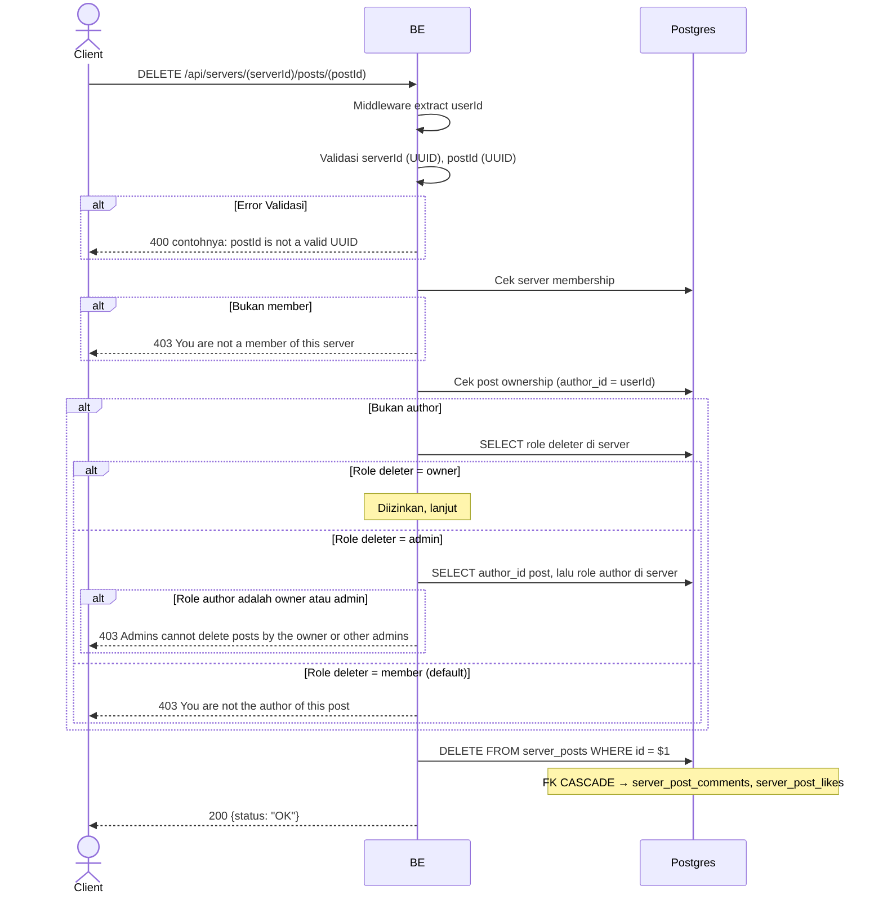

## Overview

API ini digunakan untuk hard-delete post. Author post selalu bisa menghapus post-nya sendiri. Kalau requester bukan author, server owner boleh menghapus post apapun, dan admin server boleh menghapus post apapun kecuali post yang dibuat oleh owner atau admin lain; member lain akan dapat `403 You are not the author of this post`. FK CASCADE menghapus comments + likes terkait. Image/video di MinIO sengaja dibiarkan orphan (cleanup job Phase 2).

---

## Auth

API ini adalah api protected jadi perlu authorization header `Bearer <accessToken>`.

## Flow



---

## Notes Redis

Tidak pakai Redis.

---

## Notes Postgres/DB

| Tabel            | Kolom              | Aksi   | Keterangan                                   |
| ---------------- | ------------------ | ------ | -------------------------------------------- |
| `server_members` | (count)            | SELECT | Cek membership                                |
| `server_posts`   | author_id          | SELECT | Cek ownership                                 |
| `server_members` | role_name          | SELECT | Role deleter (hanya kalau bukan author)       |
| `server_posts`   | author_id          | SELECT | Author post (hanya kalau deleter adalah admin) |
| `server_members` | role_name          | SELECT | Role author post (hanya kalau deleter adalah admin) |
| `server_posts`   | id                 | DELETE | Hard-delete (FK CASCADE → comments & likes)   |

---

## Prerequisites

User adalah member server. Bisa author post itu sendiri, server owner, atau admin server yang menghapus post yang bukan milik owner/admin lain.

---

## Validasi Request

Path parameter:

| Field      | Tipe   | Wajib | Aturan          |
| ---------- | ------ | ----- | --------------- |
| `serverId` | string | ya    | Required, UUID  |
| `postId`   | string | ya    | Required, UUID  |

Tidak ada body.

---

## Response

### 200 OK

```json
{
  "status": "OK"
}
```

### 400 Bad Request

| `error_message`                | Penyebab        |
| ------------------------------ | --------------- |
| `serverId is not a valid UUID` | UUID invalid    |
| `postId is not a valid UUID`   | UUID invalid    |

### 403 Forbidden

| `error_message`                          | Penyebab                |
| ---------------------------------------- | ----------------------- |
| `You are not a member of this server`    | Bukan member             |
| `You are not the author of this post`    | Bukan author, dan bukan server owner/admin |
| `Admins cannot delete posts by the owner or other admins` | Deleter adalah admin tapi author post adalah owner atau admin lain |

### 401 Unauthorized

Standard auth errors.

---

## Update

Dokumentasi ini diupdate tanggal 20 Juli 2026.
