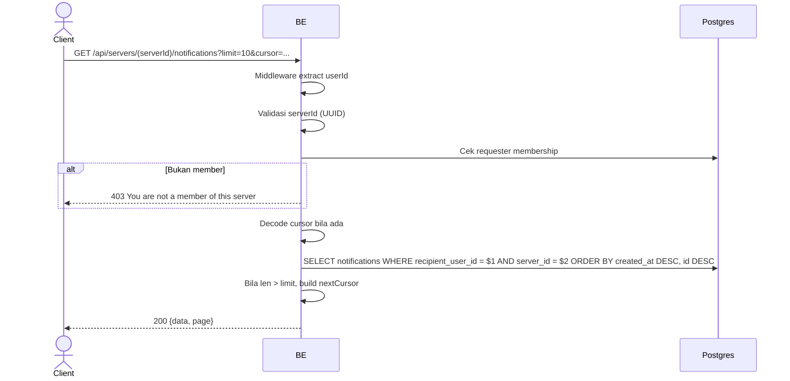

## Overview

Mengambil feed notifikasi user untuk sebuah server (per-server, tidak global). Notifikasi adalah arsip interaksi (like/comment/reply) ke konten user. Cursor-based pagination. Requester wajib member server tersebut.

---

## Auth

API protected — perlu header `Bearer <accessToken>`.

## Flow



---

## Notes Redis

Tidak pakai Redis.

---

## Notes Postgres/DB

| Tabel                    | Kolom                          | Aksi   | Keterangan                            |
| ------------------------ | ------------------------------ | ------ | ------------------------------------- |
| `server_members`         | (count)                        | SELECT | Cek requester membership              |
| `notifications`          | recipient_user_id, server_id   | SELECT | Filter notif user di server tsb       |
| `server_member_profiles` | username, avatar_image_id      | SELECT | Identitas actor per server            |
| `profile_avatar_images`  | object_key                     | SELECT | Build actorAvatarUrl                  |

---

## Prerequisites

Requester adalah member server.

---

## Validasi Request

| Field      | Tipe   | Wajib | Aturan          |
| ---------- | ------ | ----- | --------------- |
| `serverId` | string | ya    | Required, UUID  |
| `limit`    | int    | tidak | 0-20, default 10 |
| `cursor`   | string | tidak | Base64 `{createdAt, id}` |

---

## Response

### 200 OK

```json
{
  "data": [ /* NotificationResponse */ ],
  "page": { "nextCursor": "base64-or-empty" }
}
```

### 403 Forbidden

| `error_message`                       | Penyebab               |
| ------------------------------------- | ---------------------- |
| `You are not a member of this server` | Requester bukan member |

### 401 Unauthorized

Standard auth errors.

---

## Update

Dokumentasi ini dibuat tanggal 1 Juni 2026 (notifikasi per-server).
