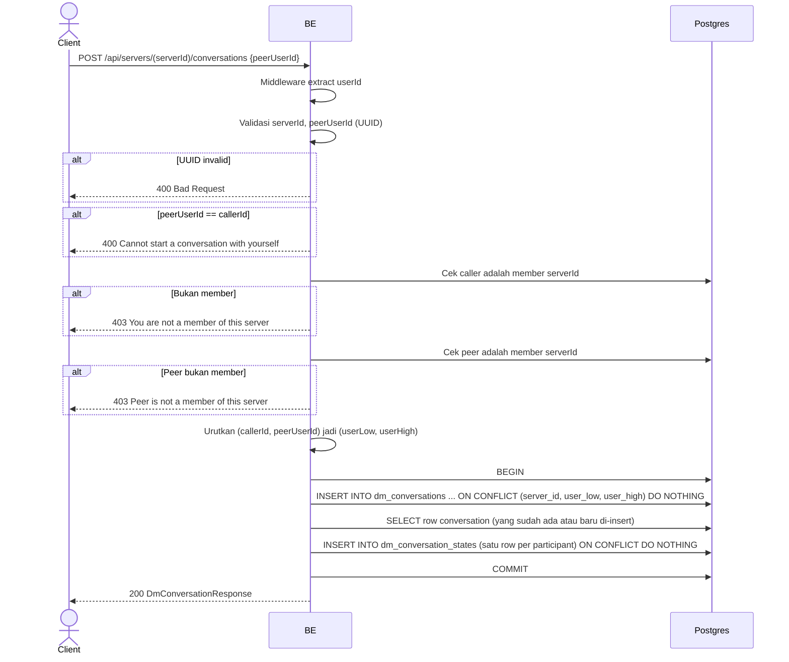

## Overview

API ini mengembalikan conversation direct-message (DM) antara caller dan member lain di server yang sama, membuatnya kalau belum ada. Idempotent — dipanggil berkali-kali untuk pasangan yang sama selalu mengembalikan conversation yang sama. Kedua user harus member server yang dimaksud; satu conversation cuma berlaku untuk satu server (dua user yang sama di server lain yang mereka berdua ikuti akan punya conversation terpisah).

---

## Auth

API ini adalah api protected jadi perlu authorization header `Bearer <accessToken>`.

## Flow



---

## Notes Redis

Tidak pakai Redis secara langsung (lihat `websocket_realtime.md` untuk bagaimana event message/read/presence disebar lewat in-process WebSocket hub).

---

## Notes Postgres/DB

| Tabel                     | Kolom                                             | Aksi   | Keterangan                                                                 |
| --------------------------- | ------------------------------------------------------ | ------ | -------------------------------------------------------------------------------- |
| `server_members`          | (count)                                                  | SELECT | Cek membership, dijalankan sekali untuk caller dan sekali untuk peer               |
| `dm_conversations`        | id, server_id, user_low, user_high                     | INSERT | Idempotent lewat `ON CONFLICT (server_id, user_low, user_high) DO NOTHING`. `user_low`/`user_high` adalah dua id participant yang diurutkan supaya pasangan selalu tersimpan dalam satu urutan baku |
| `dm_conversations`        | (lookup)                                                | SELECT | Ambil row-nya (baik baru di-insert maupun sudah ada sebelumnya)                     |
| `dm_conversation_states`  | conversation_id, user_id, server_id, peer_user_id       | INSERT | Satu row per participant (unread count, last-read cursor, preview), idempotent      |

---

## Prerequisites

Caller dan `peerUserId` sama-sama harus member `serverId`. Caller tidak boleh menargetkan dirinya sendiri.

---

## Validasi Request

Path parameter:

| Field      | Tipe   | Wajib | Aturan          |
| ---------- | ------ | ----- | --------------- |
| `serverId` | string | ya    | Required, UUID  |

Body JSON:

| Field         | Tipe   | Wajib | Aturan                                  |
| --------------- | ------ | ----- | ------------------------------------------ |
| `peerUserId`    | string | ya    | UUID, tidak boleh sama dengan id caller sendiri |

---

## Response

### 200 OK

```json
{
  "id": "conversation-uuid",
  "serverId": "server-uuid",
  "peerUserId": "peer-user-uuid",
  "peer": {
    "nickname": "",
    "username": "",
    "avatarUrl": null
  },
  "unreadCount": 0,
  "isOnline": false,
  "lastMessagePreview": null,
  "lastMessageAt": null
}
```

| Field                  | Tipe        | Deskripsi                                                                  |
| ------------------------ | ----------- | ------------------------------------------------------------------------------ |
| `id`                    | string      | UUID conversation (nilainya sama tiap kali dipanggil untuk pasangan+server yang sama) |
| `peer`                  | object      | **Tidak diisi oleh endpoint ini** — selalu dikembalikan sebagai string kosong/`null`; pakai `list_conversations.md` atau `list_dm_members.md` untuk dapat nickname/username/avatar peer yang sebenarnya |
| `unreadCount`, `isOnline`, `lastMessagePreview`, `lastMessageAt` | — | Selalu zero-value di sini; endpoint ini tidak membaca `dm_conversation_states`/presence, cuma bikin/cari conversation id-nya saja |

### 400 Bad Request

| `error_message`                             | Penyebab                       |
| ---------------------------------------------- | ------------------------------------ |
| `serverId is not a valid UUID`                 | `serverId` invalid                    |
| `peerUserId is not a valid UUID`               | `peerUserId` invalid                   |
| `Cannot start a conversation with yourself`    | `peerUserId` sama dengan caller         |

### 403 Forbidden

| `error_message`                            | Penyebab                          |
| ---------------------------------------------- | -------------------------------------- |
| `You are not a member of this server`         | Caller bukan member `serverId`          |
| `Peer is not a member of this server`         | `peerUserId` bukan member                |

### 401 Unauthorized

Standard auth errors.

---

## Update

Dokumentasi ini diupdate tanggal 20 Juli 2026.
