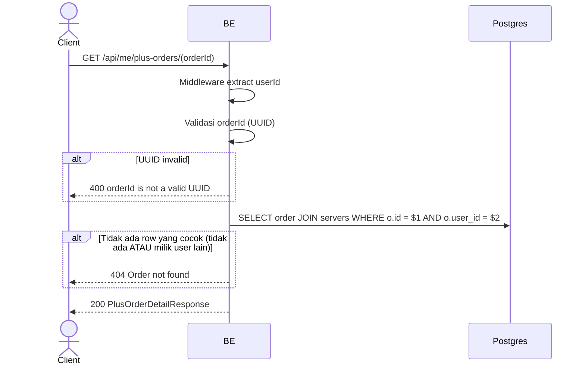

## Overview

API ini mengambil detail lengkap satu order Virdan Plus milik user yang login. Order yang ada tapi milik user lain diperlakukan sama seperti order yang tidak ada (404), jadi endpoint ini tidak pernah membocorkan apakah suatu `orderId` milik orang lain.

---

## Auth

API ini adalah api protected jadi perlu authorization header `Bearer <accessToken>`.

## Flow



---

## Notes Redis

Tidak pakai Redis.

---

## Notes Postgres/DB

| Tabel                 | Kolom                                                                                  | Aksi   | Keterangan                                          |
| --------------------- | -------------------------------------------------------------------------------------------- | ------ | ------------------------------------------------------- |
| `server_plus_orders`  | id, server_id, reference_id, base/tax/total_idr, status, paid_at, plus_expires_at, created_at | SELECT | Difilter `id = orderId AND user_id = callerId`             |
| `servers`             | name                                                                                            | SELECT | Di-join untuk `serverName`                                  |

---

## Prerequisites

Order harus milik user yang login.

---

## Validasi Request

Path parameter:

| Field     | Tipe   | Wajib | Aturan          |
| --------- | ------ | ----- | --------------- |
| `orderId` | string | ya    | Required, UUID  |

Tidak ada body.

---

## Response

### 200 OK

```json
{
  "id": "order-uuid",
  "serverId": "server-uuid",
  "serverName": "My Community",
  "referenceId": "virdan-plus-order-uuid",
  "baseIdr": 50000,
  "taxIdr": 5500,
  "totalIdr": 55500,
  "status": "PAID",
  "paidAt": "2026-06-01T10:00:00Z",
  "plusExpiresAt": "2026-07-01T10:00:00Z",
  "createdAt": "2026-06-01T09:59:00Z"
}
```

| Field           | Tipe        | Deskripsi                                       |
| --------------- | ----------- | ------------------------------------------------- |
| `referenceId`   | string      | Reference id yang dikirim ke Xendit, `virdan-plus-{orderId}` |
| `status`        | string      | `PENDING`, `PAID`, atau `FAILED`                     |
| `paidAt`        | string/null | Terisi setelah `status` jadi `PAID`                    |
| `plusExpiresAt` | string/null | Terisi setelah `status` jadi `PAID`                     |

### 400 Bad Request

| `error_message`               | Penyebab     |
| ------------------------------ | ------------ |
| `orderId is not a valid UUID`  | UUID invalid  |

### 404 Not Found

| `error_message`    | Penyebab                                             |
| -------------------- | ----------------------------------------------------- |
| `Order not found`    | Order tidak ada, atau ada tapi milik user lain          |

### 401 Unauthorized

Standard auth errors.

---

## Update

Dokumentasi ini diupdate tanggal 20 Juli 2026.
