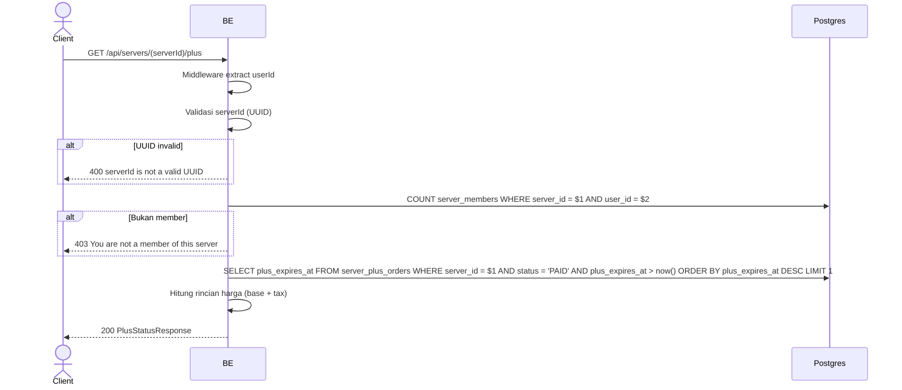

## Overview

API ini digunakan untuk mengambil status langganan Virdan Plus sebuah server: apakah sedang aktif, kapan expire-nya, dan rincian harga saat ini untuk beli/perpanjang.

---

## Auth

API ini adalah api protected jadi perlu authorization header `Bearer <accessToken>`.

## Flow



---

## Notes Redis

Tidak pakai Redis.

---

## Notes Postgres/DB

| Tabel                 | Kolom           | Aksi   | Keterangan                                                              |
| --------------------- | --------------- | ------ | ------------------------------------------------------------------------- |
| `server_members`      | (count)         | SELECT | Cek apakah caller adalah member server                                    |
| `server_plus_orders`  | plus_expires_at | SELECT | Order `PAID` terakhir yang masih berlaku (`status = 'PAID' AND plus_expires_at > now()`), yang paling lama expire-nya yang dipakai |

---

## Prerequisites

Caller harus member server yang dituju.

---

## Validasi Request

Path parameter:

| Field      | Tipe   | Wajib | Aturan          |
| ---------- | ------ | ----- | --------------- |
| `serverId` | string | ya    | Required, UUID  |

Tidak ada body.

---

## Response

### 200 OK

```json
{
  "active": false,
  "expiresAt": null,
  "durationDays": 30,
  "price": {
    "baseIdr": 50000,
    "taxIdr": 5500,
    "totalIdr": 55500
  }
}
```

| Field                 | Tipe        | Deskripsi                                                              |
| --------------------- | ----------- | -------------------------------------------------------------------------- |
| `active`              | bool        | `true` kalau ada order `PAID` yang belum expire untuk server ini            |
| `expiresAt`           | string/null | Waktu expire order yang aktif, `null` kalau `active` bernilai `false`       |
| `durationDays`        | int         | Lama langganan tetap dalam hari (saat ini `30`)                             |
| `price.baseIdr`       | int         | Harga dasar dalam IDR (saat ini `50000`)                                    |
| `price.taxIdr`        | int         | Pajak, 11% dari base, dalam IDR (saat ini `5500`)                            |
| `price.totalIdr`      | int         | `baseIdr + taxIdr` (saat ini `55500`)                                        |

### 400 Bad Request

| `error_message`                | Penyebab     |
| ------------------------------- | ------------ |
| `serverId is not a valid UUID`  | UUID invalid  |

### 403 Forbidden

| `error_message`                        | Penyebab     |
| ---------------------------------------- | ------------ |
| `You are not a member of this server`    | Bukan member  |

### 401 Unauthorized

Standard auth errors.

---

## Update

Dokumentasi ini diupdate tanggal 20 Juli 2026.
