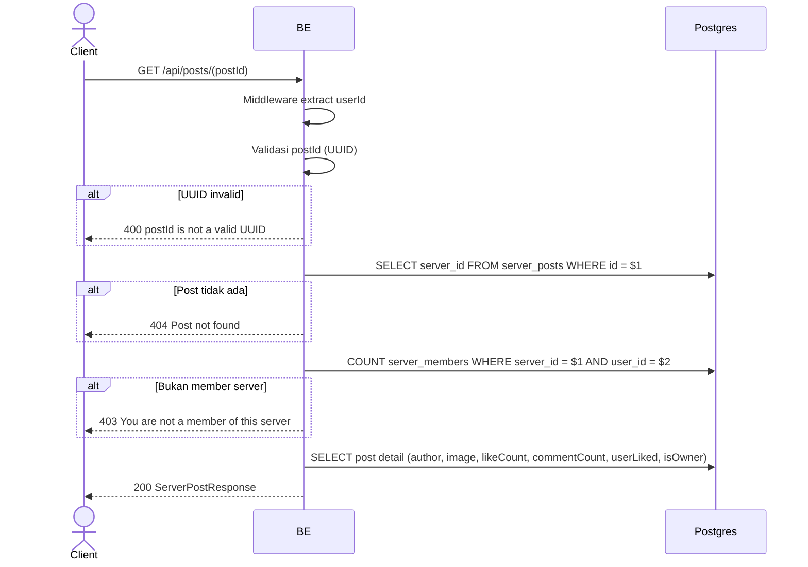

## Overview

API ini digunakan untuk ambil 1 post by id. User harus member server tempat post tsb berada.

---

## Auth

API ini adalah api protected jadi perlu authorization header `Bearer <accessToken>`.

## Flow



---

## Notes Redis

Tidak pakai Redis.

---

## Notes Postgres/DB

| Tabel                    | Kolom              | Aksi   | Keterangan                                |
| ------------------------ | ------------------ | ------ | ----------------------------------------- |
| `server_posts`           | server_id          | SELECT | Ambil server_id dari post                  |
| `server_members`         | (count)            | SELECT | Cek apakah user member server tsb          |
| `server_posts`           | (semua)            | SELECT | Detail post                                 |
| `server_post_images`     | object_key         | SELECT | Build imageUrl                              |
| `server_post_likes`      | (count + EXISTS)   | SELECT | likeCount + userLiked                       |
| `server_post_comments`   | (count)            | SELECT | commentCount                                |
| `server_member_profiles` | nickname, username, avatar_image_id | SELECT | Author identity di server   |

---

## Prerequisites

User adalah member server tempat post berada.

---

## Validasi Request

Path parameter:

| Field    | Tipe   | Wajib | Aturan          |
| -------- | ------ | ----- | --------------- |
| `postId` | string | ya    | Required, UUID  |

Tidak ada body.

---

## Response

### 200 OK

```json
{
  "id": "post-uuid",
  "serverId": "server-uuid",
  "caption": "Hello!",
  "imageUrl": "http://.../webp",
  "mediaType": "image",
  "author": {
    "userId": "user-uuid",
    "nickname": "GamerX",
    "username": "gamerx",
    "avatarUrl": "http://.../webp",
    "status": "active"
  },
  "likeCount": 12,
  "commentCount": 3,
  "userLiked": true,
  "userSaved": false,
  "isOwner": false,
  "createdAt": "2026-05-23T10:00:00Z",
  "updatedAt": "2026-05-23T10:00:00Z"
}
```

Catatan: `videoUrl`, `thumbnailUrl`, `mediaWidth`, `mediaHeight`, dan `mirrored` juga muncul kalau media post-nya adalah video.

### 400 Bad Request

| `error_message`               | Penyebab        |
| ----------------------------- | --------------- |
| `postId is not a valid UUID`  | UUID invalid    |

### 403 Forbidden

| `error_message`                          | Penyebab                                |
| ---------------------------------------- | --------------------------------------- |
| `You are not a member of this server`    | Bukan member server tempat post berada   |

### 404 Not Found

| `error_message`     | Penyebab            |
| ------------------- | ------------------- |
| `Post not found`    | Post tidak ada       |

### 401 Unauthorized

Standard auth errors.

---

## Update

Dokumentasi ini diupdate tanggal 20 Juli 2026.
