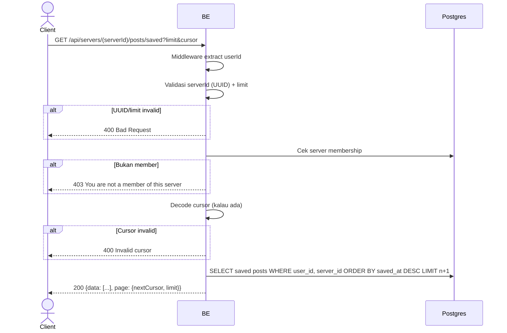

## Overview

API ini digunakan untuk mengambil daftar post yang sudah di-save user di dalam sebuah server (per-server, bukan cross-server). Hasil diurutkan dari yang paling baru disimpan (`server_post_saves.created_at DESC`). Cursor-based pagination. Post yang author-nya sudah leave/delete tetap tampil dengan `author.status` (`user_left`/`user_deleted`).

---

## Auth

API ini adalah api protected jadi perlu authorization header `Bearer <accessToken>`.

## Flow



---

## Notes Redis

Tidak pakai Redis.

---

## Notes Postgres/DB

| Tabel                     | Kolom                 | Aksi   | Keterangan                                          |
| ------------------------- | --------------------- | ------ | --------------------------------------------------- |
| `server_members`          | (count)               | SELECT | Cek membership requester                            |
| `server_post_saves`       | user_id, created_at   | SELECT | Sumber saved feed, urut waktu save desc, filter cursor |
| `server_posts`            | (join)                | SELECT | Data post + filter `server_id`                      |
| `users`                   | deleted_at            | SELECT | Status author (user_deleted)                        |
| `server_members`          | (left join author)    | SELECT | Status author (user_left)                           |
| `server_member_profiles`  | nickname, username    | SELECT | Identitas author per-server                         |
| `server_post_likes`       | (count + exists)      | SELECT | likeCount + userLiked                               |
| `server_post_comments`    | (count)               | SELECT | commentCount                                        |

---

## Prerequisites

User adalah member server yang diminta.

---

## Validasi Request

Path parameter:

| Field      | Tipe   | Wajib | Aturan          |
| ---------- | ------ | ----- | --------------- |
| `serverId` | string | ya    | Required, UUID  |

Query parameter:

| Field    | Tipe   | Wajib | Aturan                       |
| -------- | ------ | ----- | ---------------------------- |
| `limit`  | int    | tidak | 0..MAX_LIMIT (default)       |
| `cursor` | string | tidak | Cursor dari response sebelumnya |

---

## Response

### 200 OK

```json
{
  "data": [
    {
      "id": "post-uuid",
      "serverId": "server-uuid",
      "caption": "Hello",
      "imageUrl": "http://.../post/image/uuid.webp",
      "author": {
        "userId": "user-uuid",
        "nickname": "GamerX",
        "username": "gamerx",
        "avatarUrl": null,
        "status": "active"
      },
      "likeCount": 3,
      "commentCount": 1,
      "userLiked": false,
      "userSaved": true,
      "savedAt": "2026-06-02T07:00:00Z",
      "isOwner": false,
      "createdAt": "2026-05-20T10:00:00Z",
      "updatedAt": "2026-05-20T10:00:00Z"
    }
  ],
  "page": {
    "nextCursor": "base64-cursor-or-null",
    "limit": 10
  }
}
```

| Field        | Tipe        | Deskripsi                                          |
| ------------ | ----------- | -------------------------------------------------- |
| `userSaved`  | bool        | Selalu `true` di saved feed                        |
| `savedAt`    | string/null | Waktu post disimpan (`server_post_saves.created_at`), dasar urutan + cursor |
| `author.status` | string   | `active`, `user_left`, atau `user_deleted`         |

### 400 Bad Request

| `error_message`                 | Penyebab          |
| ------------------------------- | ----------------- |
| `serverId is not a valid UUID`  | UUID invalid       |
| `Invalid cursor`                | Cursor rusak       |

### 403 Forbidden

| `error_message`                          | Penyebab     |
| ---------------------------------------- | ------------ |
| `You are not a member of this server`    | Bukan member  |

### 401 Unauthorized

Standard auth errors.

---

## Update

Dokumentasi ini diupdate tanggal 2 Juni 2026.
