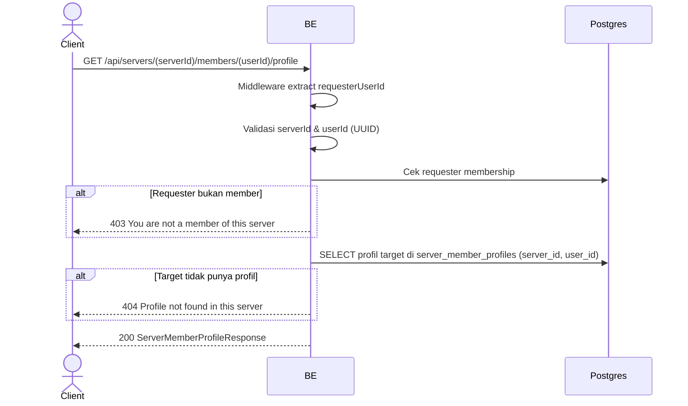

## Overview

API ini digunakan untuk melihat profil member lain di sebuah server (view-only). Profil bersifat per-server (multi-identity Opsi B), jadi yang dikembalikan adalah identitas target khusus di server tersebut. Requester wajib member server agar tidak bisa enumerasi roster server private.

---

## Auth

API ini adalah api protected jadi perlu authorization header `Bearer <accessToken>`.

## Flow



---

## Notes Redis

Tidak pakai Redis.

---

## Notes Postgres/DB

| Tabel                    | Kolom                                    | Aksi   | Keterangan                  |
| ------------------------ | ---------------------------------------- | ------ | --------------------------- |
| `server_members`         | (count)                                  | SELECT | Cek requester membership    |
| `server_member_profiles` | nickname, username, bio, avatar_image_id | SELECT | Profil target per server    |
| `profile_avatar_images`  | object_key                               | SELECT | Build avatarUrl             |

---

## Prerequisites

Requester adalah member server. Target user pernah/masih punya profil di server (snapshot copy-on-join tetap ada walau target sudah leave).

---

## Validasi Request

Path parameter:

| Field      | Tipe   | Wajib | Aturan         |
| ---------- | ------ | ----- | -------------- |
| `serverId` | string | ya    | Required, UUID |
| `userId`   | string | ya    | Required, UUID |

---

## Response

### 200 OK

```json
{
  "profileId": "uuid",
  "serverId": "uuid",
  "nickname": "BudiPro",
  "username": "budipro",
  "bio": "Always grinding",
  "avatarImageId": "uuid-or-null",
  "avatarUrl": "https://...-or-null",
  "createdAt": "2026-06-01T10:30:00Z",
  "updatedAt": "2026-06-01T10:30:00Z"
}
```

### 400 Bad Request

| `error_message`                | Penyebab     |
| ------------------------------ | ------------ |
| `serverId is not a valid UUID` | UUID invalid |
| `userId is not a valid UUID`   | UUID invalid |

### 403 Forbidden

| `error_message`                       | Penyebab              |
| ------------------------------------- | --------------------- |
| `You are not a member of this server` | Requester bukan member |

### 404 Not Found

| `error_message`                      | Penyebab                              |
| ------------------------------------ | ------------------------------------- |
| `Profile not found in this server`   | Target tidak punya profil di server   |

### 401 Unauthorized

Standard auth errors.

---

## Update

Dokumentasi ini dibuat tanggal 1 Juni 2026.
