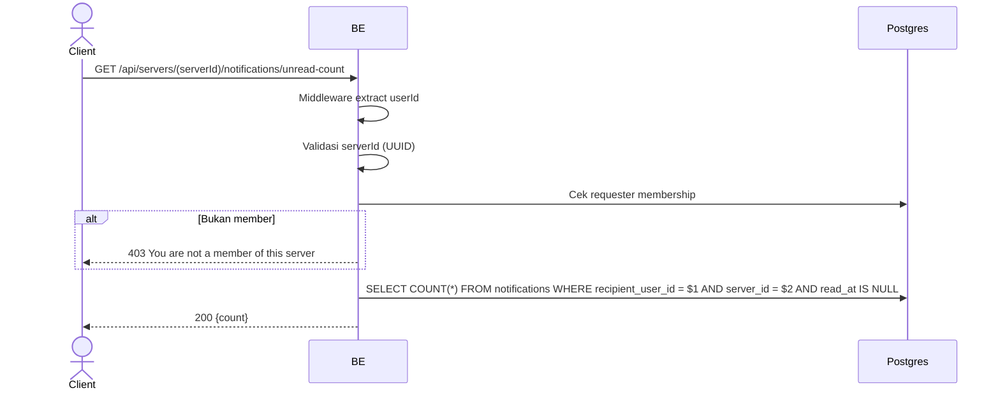

## Overview

Mengambil jumlah notifikasi belum dibaca (unread) untuk badge, per-server. Requester wajib member server.

---

## Auth

API protected — perlu header `Bearer <accessToken>`.

## Flow



---

## Notes Redis

Tidak pakai Redis.

---

## Notes Postgres/DB

| Tabel            | Kolom                        | Aksi   | Keterangan                         |
| ---------------- | ---------------------------- | ------ | ---------------------------------- |
| `server_members` | (count)                      | SELECT | Cek requester membership           |
| `notifications`  | recipient_user_id, server_id | SELECT | COUNT unread (read_at IS NULL)     |

---

## Prerequisites

Requester adalah member server.

---

## Validasi Request

| Field      | Tipe   | Wajib | Aturan         |
| ---------- | ------ | ----- | -------------- |
| `serverId` | string | ya    | Required, UUID |

---

## Response

### 200 OK

```json
{ "count": 3 }
```

### 400 Bad Request

| `error_message`                 | Penyebab                          |
| -------------------------------- | ---------------------------------- |
| `serverId is required`          | Segmen path serverId kosong        |
| `serverId is not a valid UUID`  | serverId bukan format UUID         |

### 403 Forbidden

| `error_message`                       | Penyebab               |
| ------------------------------------- | ---------------------- |
| `You are not a member of this server` | Requester bukan member |

### 401 Unauthorized

Standard auth errors.

---

## Update

Dokumentasi ini dibuat tanggal 1 Juni 2026 (notifikasi per-server).
Diupdate tanggal 20 Juli 2026 (menambahkan tabel error validasi 400 Bad Request).
