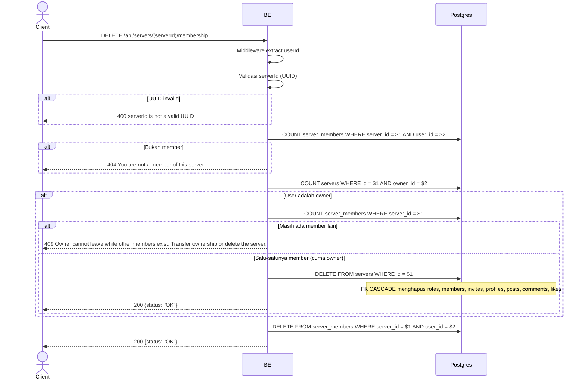

## Overview

API ini digunakan untuk leave server. Kalau owner leave sementara member lain masih ada, request ditolak (409) — owner harus transfer ownership atau delete server dulu. Tapi kalau owner adalah satu-satunya member yang tersisa, leave justru hard-delete seluruh server (FK CASCADE bersihin roles/members/invites/profiles/posts/comments/likes) dan return 200. Untuk member biasa (bukan owner), row `server_members` di-hard-delete, tapi `server_member_profiles` tetap disimpan (historical snapshot).

---

## Auth

API ini adalah api protected jadi perlu authorization header `Bearer <accessToken>`.

## Flow



---

## Notes Redis

Tidak pakai Redis.

---

## Notes Postgres/DB

| Tabel             | Kolom              | Aksi   | Keterangan                                           |
| ----------------- | ------------------ | ------ | ----------------------------------------------------- |
| `server_members`  | (count)            | SELECT | Cek apakah user member                                 |
| `servers`         | owner_id           | SELECT | Cek apakah user adalah owner                           |
| `server_members`  | (count)            | SELECT | Kalau owner: hitung total member di server tersebut    |
| `servers`         | id                 | DELETE | Kalau owner satu-satunya member: hard-delete seluruh server (FK CASCADE) |
| `server_members`  | server_id, user_id | DELETE | Kalau bukan owner (atau owner bukan satu-satunya member, malah ditolak): hard-delete membership |

Catatan: row di `server_member_profiles` tidak ikut dihapus saat member biasa leave — snapshot disimpan untuk history (lihat endpoint `get_profile_history`). Ini tidak berlaku kalau owner tunggal yang leave, karena seluruh server (beserta profile-nya) ikut dihapus.

---

## Prerequisites

User adalah member server. Kalau user adalah owner, dia cuma boleh leave kalau dia satu-satunya member yang tersisa (yang otomatis menghapus server); selain itu dia harus transfer ownership atau delete server dulu.

---

## Validasi Request

Path parameter:

| Field      | Tipe   | Wajib | Aturan          |
| ---------- | ------ | ----- | --------------- |
| `serverId` | string | ya    | Required, UUID  |

Tidak ada body.

---

## Response

### 200 OK

```json
{
  "status": "OK"
}
```

Di-return baik untuk member biasa yang leave (row membership dihapus) maupun untuk owner tunggal yang leave (seluruh server dihapus).

### 400 Bad Request

| `error_message`                  | Penyebab     |
| -------------------------------- | ------------ |
| `serverId is not a valid UUID`   | UUID invalid  |

### 404 Not Found

| `error_message`                         | Penyebab            |
| --------------------------------------- | ------------------- |
| `You are not a member of this server`   | User bukan member   |

### 409 Conflict

| `error_message`                                                                          | Penyebab                                              |
| ------------------------------------------------------------------------------------------ | -------------------------------------------------------- |
| `Owner cannot leave while other members exist. Transfer ownership or delete the server.` | User adalah owner dan masih ada member lain             |

### 401 Unauthorized

Standard auth errors.

---

## Update

Dokumentasi ini diupdate tanggal 20 Juli 2026.
