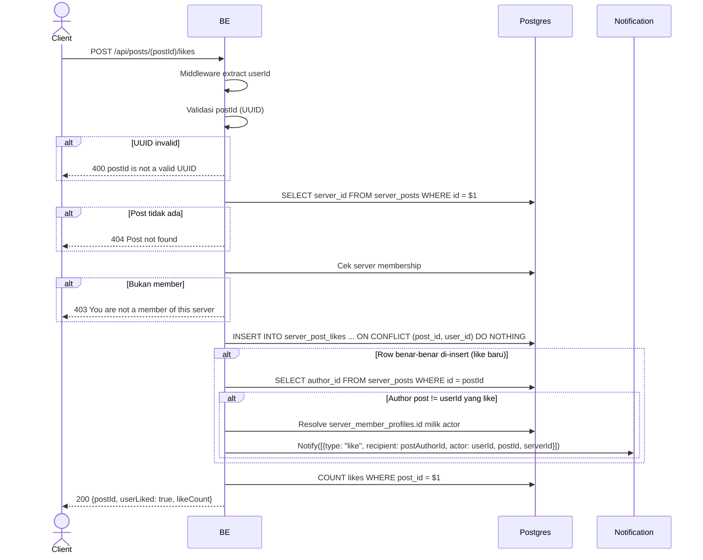

## Overview

API ini digunakan untuk like post. Idempotent — kalau user sudah like sebelumnya, request kedua tidak error (pakai `ON CONFLICT (post_id, user_id) DO NOTHING`). Return likeCount terbaru + `userLiked: true`. Kalau row like baru benar-benar di-insert (bukan duplikat) dan author post adalah user yang berbeda dari yang melakukan like, push notification `"like"` dikirim ke author post.

---

## Auth

API ini adalah api protected jadi perlu authorization header `Bearer <accessToken>`.

## Flow



---

## Notes Redis

Tidak pakai Redis.

---

## Notes Postgres/DB

| Tabel                | Kolom                                  | Aksi   | Keterangan                                          |
| -------------------- | -------------------------------------- | ------ | --------------------------------------------------- |
| `server_posts`       | server_id                              | SELECT | Ambil server_id buat membership check                |
| `server_members`     | (count)                                | SELECT | Cek membership                                      |
| `server_post_likes`  | id, post_id, user_id, created_at, ... | INSERT | Idempotent dengan `ON CONFLICT (post_id, user_id) DO NOTHING` |
| `server_posts`       | author_id                              | SELECT | Resolve author post (di-skip kalau like-nya duplikat) |
| `server_member_profiles` | (profile id)                       | SELECT | Resolve profile id actor untuk notifikasi (di-skip kalau author == actor) |
| `server_post_likes`  | (count)                                | SELECT | likeCount baru                                       |

Catatan: notifikasi `like` hanya dikirim kalau ada row like **baru** yang di-insert (bukan like duplikat/idempotent) dan hanya kalau author post adalah user yang **berbeda** dari actor (tidak ada self-notification).

---

## Prerequisites

User adalah member server tempat post berada.

---

## Validasi Request

Path parameter:

| Field    | Tipe   | Wajib | Aturan          |
| -------- | ------ | ----- | --------------- |
| `postId` | string | ya    | Required, UUID  |

Tidak ada body.

---

## Response

### 200 OK

```json
{
  "postId": "post-uuid",
  "userLiked": true,
  "likeCount": 13
}
```

| Field       | Tipe   | Deskripsi                                       |
| ----------- | ------ | ----------------------------------------------- |
| `postId`    | string | UUID post                                       |
| `userLiked` | bool   | Selalu `true` setelah endpoint ini sukses        |
| `likeCount` | int    | Total like terbaru                              |

### 400 Bad Request

| `error_message`               | Penyebab     |
| ----------------------------- | ------------ |
| `postId is not a valid UUID`  | UUID invalid  |

### 403 Forbidden

| `error_message`                          | Penyebab     |
| ---------------------------------------- | ------------ |
| `You are not a member of this server`    | Bukan member  |

### 404 Not Found

| `error_message`     | Penyebab            |
| ------------------- | ------------------- |
| `Post not found`    | Post tidak ada       |

### 401 Unauthorized

Standard auth errors.

---

## Update

Dokumentasi ini diupdate tanggal 20 Juli 2026.
