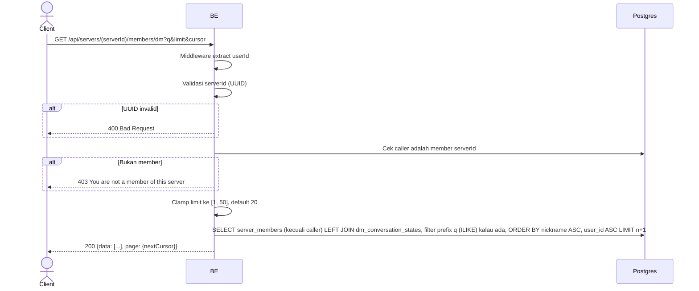

## Overview

API ini menampilkan member lain di server yang bisa diajak DM oleh caller — dipakai untuk UI "new DM" / member picker. Mendukung pencarian prefix opsional di nickname/username dan cursor-based pagination. Untuk tiap member, endpoint ini juga mengembalikan conversation id yang sudah ada (kalau ada) plus unread count dan preview pesan terakhir, jadi list yang sama bisa dipakai sebagai gabungan "daftar kontak + DM terbaru".

---

## Auth

API ini adalah api protected jadi perlu authorization header `Bearer <accessToken>`.

## Flow



---

## Notes Redis

Tidak pakai Redis.

---

## Notes Postgres/DB

| Tabel                      | Kolom                                                              | Aksi   | Keterangan                                                                       |
| ---------------------------- | -------------------------------------------------------------------------- | ------ | -------------------------------------------------------------------------------------- |
| `server_members`           | user_id                                                                      | SELECT | Semua member `serverId` kecuali caller (`user_id <> callerId`)                          |
| `server_member_profiles`   | nickname, username                                                            | SELECT | Identitas per-server, di-join per member                                                 |
| `profile_avatar_images`    | object_key                                                                    | SELECT | Avatar (left join)                                                                         |
| `dm_conversation_states`   | conversation_id, unread_count, last_message_preview, last_message_at         | SELECT | Left join pada `(server_id, user_id=caller, peer_user_id=member)` — `null` kalau belum ada conversation dengan member itu |

Pencarian (`q`) mencocokkan `nickname ILIKE 'q%' OR username ILIKE 'q%'` (prefix match, case-insensitive). Urutan dan cursor pagination sama-sama berbasis `(nickname, user_id)`, bukan berdasarkan kebaruan conversation.

---

## Prerequisites

Caller harus member `serverId`.

---

## Validasi Request

Path parameter:

| Field      | Tipe   | Wajib | Aturan          |
| ---------- | ------ | ----- | --------------- |
| `serverId` | string | ya    | Required, UUID  |

Query parameter:

| Field    | Tipe   | Wajib | Aturan                                                     |
| -------- | ------ | ----- | -------------------------------------------------------------- |
| `q`      | string | tidak | Filter prefix di nickname/username, tidak ada batas panjang       |
| `limit`  | int    | tidak | Default `20`; nilai `<= 0` jatuh ke default, nilai `> 50` di-clamp ke `50` |
| `cursor` | string | tidak | Cursor opaque dari `page.nextCursor` response sebelumnya; di-decode secara best-effort |

---

## Response

### 200 OK

```json
{
  "data": [
    {
      "userId": "peer-user-uuid",
      "identity": {
        "nickname": "GamerX",
        "username": "gamerx",
        "avatarUrl": null
      },
      "conversationId": null,
      "unreadCount": 0,
      "lastMessagePreview": null,
      "lastMessageAt": null
    }
  ],
  "page": {
    "nextCursor": "base64-cursor-or-empty"
  }
}
```

| Field              | Tipe        | Deskripsi                                                          |
| --------------------- | ----------- | ---------------------------------------------------------------------- |
| `conversationId`     | string/null | Conversation yang sudah ada dengan member ini, atau `null` kalau belum pernah dibuat |
| `unreadCount`        | int         | Unread count caller untuk conversation itu (`0` kalau `conversationId` bernilai `null`) |

### 400 Bad Request

| `error_message`                | Penyebab     |
| ------------------------------- | ------------ |
| `serverId is not a valid UUID`  | UUID invalid  |

### 403 Forbidden

| `error_message`                        | Penyebab     |
| ---------------------------------------- | ------------ |
| `You are not a member of this server`    | Bukan member  |

### 401 Unauthorized

Standard auth errors.

---

## Update

Dokumentasi ini diupdate tanggal 20 Juli 2026.
