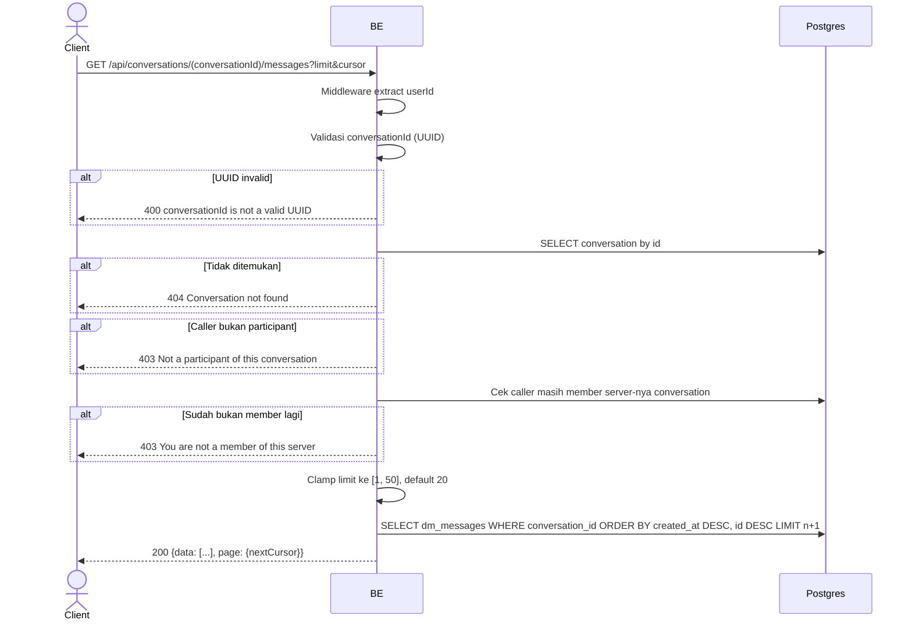

## Overview

API ini menampilkan pesan-pesan di sebuah conversation, dari yang paling baru, untuk pagination backward/infinite-scroll (client menelusuri riwayat lebih jauh dengan mengirim cursor dari halaman sebelumnya).

---

## Auth

API ini adalah api protected jadi perlu authorization header `Bearer <accessToken>`.

## Flow



---

## Notes Redis

Tidak pakai Redis.

---

## Notes Postgres/DB

| Tabel                     | Kolom                                                          | Aksi   | Keterangan                                                 |
| --------------------------- | ---------------------------------------------------------------------- | ------ | ------------------------------------------------------------- |
| `dm_conversations`        | (lookup)                                                                  | SELECT | Ambil conversation buat cek participant + membership server       |
| `server_members`          | (count)                                                                    | SELECT | Cek ulang caller masih member server                                |
| `dm_messages`             | id, sender_id, type, content, client_message_id, created_at              | SELECT | Terbaru dulu, cursor + limit                                        |
| `server_member_profiles`  | nickname, username                                                        | SELECT | Identitas pengirim (left join)                                      |
| `profile_avatar_images`   | object_key                                                                | SELECT | Avatar pengirim (left join)                                          |

---

## Prerequisites

Caller harus salah satu dari dua participant `conversationId`, dan masih member server tempat conversation itu berada.

---

## Validasi Request

Path parameter:

| Field             | Tipe   | Wajib | Aturan          |
| ------------------- | ------ | ----- | --------------- |
| `conversationId`   | string | ya    | Required, UUID  |

Query parameter:

| Field    | Tipe   | Wajib | Aturan                                                     |
| -------- | ------ | ----- | -------------------------------------------------------------- |
| `limit`  | int    | tidak | Default `20`; nilai `<= 0` jatuh ke default, nilai `> 50` di-clamp ke `50` |
| `cursor` | string | tidak | Cursor opaque dari `page.nextCursor` response sebelumnya; di-decode secara best-effort |

---

## Response

### 200 OK

```json
{
  "data": [
    {
      "id": "message-uuid",
      "conversationId": "conversation-uuid",
      "senderId": "sender-uuid",
      "sender": {
        "nickname": "GamerX",
        "username": "gamerx",
        "avatarUrl": null
      },
      "type": "text",
      "content": "hello!",
      "clientMessageId": "client-generated-uuid",
      "createdAt": "2026-06-01T10:00:00Z"
    }
  ],
  "page": {
    "nextCursor": "base64-cursor-or-empty"
  }
}
```

Pesan diurutkan dari yang paling baru (`createdAt DESC`); untuk lihat riwayat lebih jauh ke belakang, kirim `page.nextCursor` sebagai `cursor` di request berikutnya.

### 400 Bad Request

| `error_message`                    | Penyebab     |
| -------------------------------------- | ------------ |
| `conversationId is not a valid UUID`  | UUID invalid  |

### 403 Forbidden

| `error_message`                            | Penyebab                                                  |
| ---------------------------------------------- | ---------------------------------------------------------------- |
| `Not a participant of this conversation`      | Caller bukan participant conversation itu                            |
| `You are not a member of this server`         | Caller sudah keluar dari server tempat conversation itu berada         |

### 404 Not Found

| `error_message`             | Penyebab                        |
| -------------------------------- | ------------------------------------ |
| `Conversation not found`        | `conversationId` tidak ada             |

### 401 Unauthorized

Standard auth errors.

---

## Update

Dokumentasi ini diupdate tanggal 20 Juli 2026.
