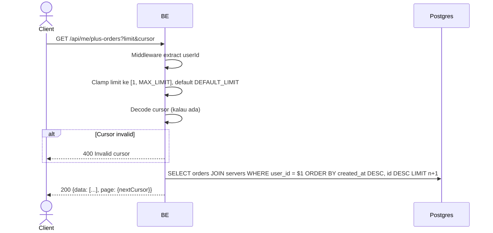

## Overview

API ini menampilkan riwayat pembelian Virdan Plus milik user yang login, di semua server, dari yang paling baru. Cursor-based pagination.

---

## Auth

API ini adalah api protected jadi perlu authorization header `Bearer <accessToken>`.

## Flow



---

## Notes Redis

Tidak pakai Redis.

---

## Notes Postgres/DB

| Tabel                 | Kolom                                                                      | Aksi   | Keterangan                                        |
| --------------------- | ------------------------------------------------------------------------------ | ------ | ------------------------------------------------------ |
| `server_plus_orders`  | id, server_id, total_idr, status, paid_at, plus_expires_at, created_at         | SELECT | Order milik caller, cursor + limit                       |
| `servers`             | name                                                                            | SELECT | Di-join untuk `serverName`                                |

---

## Prerequisites

Tidak ada selain autentikasi — semua user bisa lihat order miliknya sendiri.

---

## Validasi Request

Query parameter:

| Field    | Tipe   | Wajib | Aturan                                             |
| -------- | ------ | ----- | -------------------------------------------------- |
| `limit`  | int    | tidak | Default `10`; nilai `<= 0` atau `> 20` otomatis jatuh ke default (nilai invalid di-clamp diam-diam, bukan ditolak) |
| `cursor` | string | tidak | Cursor opaque dari `page.nextCursor` response sebelumnya |

Tidak ada path parameter, tidak ada body.

---

## Response

### 200 OK

```json
{
  "data": [
    {
      "id": "order-uuid",
      "serverId": "server-uuid",
      "serverName": "My Community",
      "totalIdr": 55500,
      "status": "PAID",
      "paidAt": "2026-06-01T10:00:00Z",
      "plusExpiresAt": "2026-07-01T10:00:00Z",
      "createdAt": "2026-06-01T09:59:00Z"
    }
  ],
  "page": {
    "nextCursor": "base64-cursor-or-empty"
  }
}
```

| Field           | Tipe        | Deskripsi                                        |
| --------------- | ----------- | ------------------------------------------------- |
| `status`        | string      | `PENDING`, `PAID`, atau `FAILED`                     |
| `paidAt`        | string/null | Terisi setelah order berpindah status ke `PAID`      |
| `plusExpiresAt` | string/null | Terisi setelah order berpindah status ke `PAID`       |

List kosong dikembalikan (bukan error) kalau caller belum pernah beli Virdan Plus.

### 400 Bad Request

| `error_message`     | Penyebab         |
| -------------------- | ----------------- |
| `Invalid cursor`     | Cursor rusak       |

### 401 Unauthorized

Standard auth errors.

---

## Update

Dokumentasi ini diupdate tanggal 20 Juli 2026.
