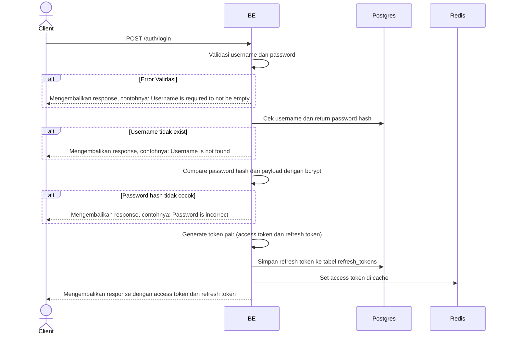

## Overview

Api ini digunakan untuk login dengan username dan password.

---

## Auth

API ini adalah api public jadi tidak perlu authorization header

## Flow



---

## Notes Redis

1. auth access token:
   key: auth:accessToken:(userId)
   value: hashed(accessToken)
   expiry: 15 menit

---

## Notes Postgres/DB

| Tabel            | Kolom        | Aksi   | Keterangan                                          |
| ---------------- | ------------ | ------ | --------------------------------------------------- |
| `users`          | id           | SELECT | Select user id untuk token generation               |
| `users`          | password     | SELECT | Select password hash untuk verifikasi dengan bcrypt |
| `refresh_tokens` | id           | INSERT | Insert UUID sebagai primary key refresh token       |
| `refresh_tokens` | user_id      | INSERT | Insert user id yang owner dari refresh token        |
| `refresh_tokens` | token_hash   | INSERT | Insert hash dari refresh token untuk keamanan       |
| `refresh_tokens` | token_family | INSERT | Insert token family (UUID) untuk token rotation     |
| `refresh_tokens` | expires_at   | INSERT | Insert expiry time refresh token (7 hari)           |
| `refresh_tokens` | created_at   | INSERT | Insert timestamp creation refresh token             |
| `refresh_tokens` | updated_at   | INSERT | Insert timestamp last update refresh token          |
| `refresh_tokens` | created_by   | INSERT | Insert user id yang membuat refresh token           |
| `refresh_tokens` | updated_by   | INSERT | Insert user id yang mengupdate refresh token        |

## Prerequisites

Tidak ada, bisa hit api ini pada kondisi apapun misalnya sedang ada sesi register yang aktif atau tidak.

---

## Validasi Request

| Field      | Tipe   | Wajib | Aturan                                                             |
| ---------- | ------ | ----- | ------------------------------------------------------------------ |
| `username` | string | ya    | Username min 4 karakter, max 22, case-insensitive (jadi lowercase) |
| `password` | string | ya    | Password min 5 karakter, max 20                                    |

**Catatan:** Username akan di-convert ke lowercase sebelum dicek di database.

---

## Response

### 200 OK

```json
{
  "access_token": "eyJhbGciOiJIUzI1NiIsInR5cCI6IkpXVCJ9...",
  "access_token_expires_in": 900,
  "refresh_token": "550e8400-e29b-41d4-a716-446655440000",
  "refresh_token_expires_in": 604800,
  "token_type": "Bearer"
}
```

| Field                      | Tipe   | Deskripsi                                          |
| -------------------------- | ------ | -------------------------------------------------- |
| `access_token`             | string | JWT access token untuk auth request                |
| `access_token_expires_in`  | int    | Access token expiry dalam detik (900)              |
| `refresh_token`            | string | Refresh token untuk dapatkan token baru            |
| `refresh_token_expires_in` | int    | Refresh token expiry dalam detik (604800 = 7 hari) |
| `token_type`               | string | Tipe token, selalu "Bearer"                        |

### 400 Bad Request

| `error_message`                          | Penyebab                        |
| ---------------------------------------- | ------------------------------- |
| `Username is required to not be empty`   | Username tidak diisi            |
| `Username must be at least 4 characters` | Username kurang dari 4 karakter |
| `username must be at most 22 characters` | Username lebih dari 22 karakter |
| `Password is required to not be empty`   | Password tidak diisi            |
| `Password must be at least 5 characters` | Password kurang dari 5 karakter |
| `Password must be at most 20 characters` | Password lebih dari 20 karakter |
| `Username is not found`                  | Username tidak terdaftar        |
| `Password is incorrect`                  | Password salah                  |

---

## Update

Dokumentasi ini diupdate tanggal 20 April 2026.
