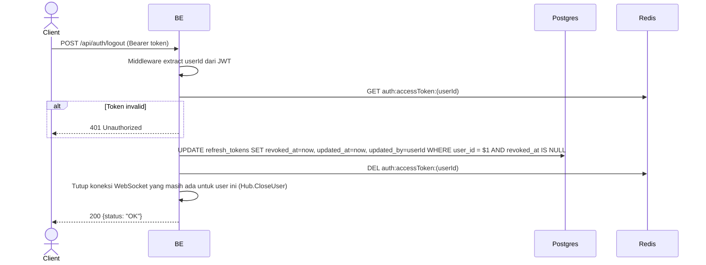

## Overview

API ini digunakan untuk logout. Backend revoke SEMUA refresh token user dan hapus access token cache di Redis. Setelah logout, user harus login ulang.

---

## Auth

API ini adalah api protected jadi perlu authorization header `Bearer <accessToken>`.

## Flow



---

## Notes Redis

1. auth access token:
   key: `auth:accessToken:(userId)`
   aksi: DEL

---

## Notes Postgres/DB

| Tabel            | Kolom      | Aksi   | Keterangan                                          |
| ---------------- | ---------- | ------ | --------------------------------------------------- |
| `refresh_tokens` | revoked_at | UPDATE | Set timestamp revoke untuk semua token aktif user   |
| `refresh_tokens` | updated_at | UPDATE | UTC now                                             |
| `refresh_tokens` | updated_by | UPDATE | userId yang melakukan logout                        |

---

## Prerequisites

User sudah login dan punya access token valid.

---

## Validasi Request

Endpoint ini tidak menerima body. Otentikasi via header `Authorization: Bearer <accessToken>`.

---

## Response

### 200 OK

```json
{
  "status": "OK"
}
```

### 401 Unauthorized

| `error_message`                              | Penyebab                                |
| -------------------------------------------- | --------------------------------------- |
| `Authorization header is missing`            | Header tidak ada                        |
| `Invalid authorization scheme`               | Tidak pakai Bearer prefix               |
| `Authentication token is expired`            | JWT sudah expired                       |
| `Authentication token is invalid`            | JWT invalid                              |
| `Authorization token not found or expired`   | Token tidak ada di cache Redis           |

---

## Update

Dokumentasi ini diupdate tanggal 20 Juli 2026.
