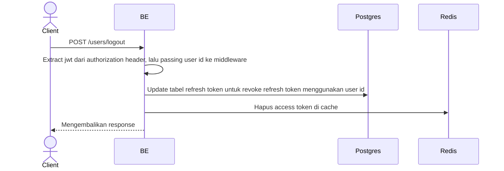

## Overview

Api ini digunakan untuk logout. Authorization header yang dikirimkan akan diextract user idnya lalu hapus access token di redis dan revoke refresh tokennya di postgres.

---

## Auth

API ini adalah api protected jadi perlu authorization header

## Flow



---

## Notes Redis

1. auth access token:
   key: auth:accessToken:(userId)
   value: hashed(accessToken)
   expiry: 15 menit
   aksi: DEL (Hapus key)

---

## Notes Postgres/DB

| Tabel            | Kolom      | Aksi   | Keterangan                                            |
| ---------------- | ---------- | ------ | ----------------------------------------------------- |
| `refresh_tokens` | revoked_at | UPDATE | Set timestamp pencabutan untuk semua token aktif user |
| `refresh_tokens` | updated_at | UPDATE | Update timestamp pembaruan data                       |
| `refresh_tokens` | updated_by | UPDATE | Set user id yang melakukan aksi logout                |

## Prerequisites

User harus sudah login dan memiliki access token yang valid.

---

## Validasi Request

API ini tidak memerlukan request body. Identifikasi user dilakukan melalui Bearer Token pada Authorization Header.

---

## Response

### 200 OK

```json
{
  "status": "OK"
}
```

| Field    | Tipe   | Deskripsi      |
| -------- | ------ | -------------- |
| `status` | string | Status message |

### 401 Unauthorized

| `error_message` | Penyebab                                |
| --------------- | --------------------------------------- |
| `Unauthorized`  | Token tidak valid atau tidak disertakan |

---

## Update

Dokumentasi ini diupdate tanggal 21 April 2026.
