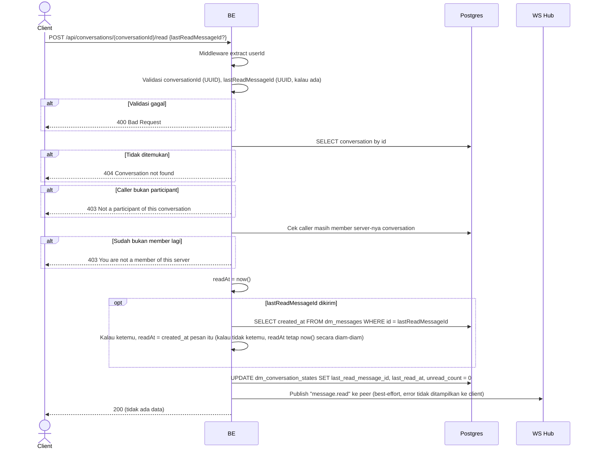

## Overview

API ini menandai sebuah conversation sebagai sudah dibaca untuk caller: unread counter-nya di-reset ke nol dan cursor "sudah dibaca" dicatat. Endpoint ini juga memberi tahu peer lewat koneksi WebSocket live-nya (kalau ada) bahwa pesannya sudah dibaca, jadi client peer bisa menampilkan indikator "seen".

---

## Auth

API ini adalah api protected jadi perlu authorization header `Bearer <accessToken>`.

## Flow

---

## Notes Redis

Tidak pakai Redis. Fanout read-receipt lewat in-process WebSocket hub — lihat `websocket_realtime.md`.

---

## Notes Postgres/DB

| Tabel                     | Kolom                                          | Aksi   | Keterangan                                                                    |
| --------------------------- | ------------------------------------------------------ | ------ | ------------------------------------------------------------------------------------ |
| `dm_conversations`        | (lookup)                                                  | SELECT | Ambil conversation buat cek participant + membership server                             |
| `server_members`          | (count)                                                    | SELECT | Cek ulang caller masih member server                                                     |
| `dm_messages`             | created_at                                                | SELECT | Cuma dijalankan kalau `lastReadMessageId` dikirim, buat timestamp read cursor yang akurat  |
| `dm_conversation_states`  | last_read_message_id, last_read_at, unread_count         | UPDATE | Row untuk `(conversationId, callerId)`; `unread_count` di-reset ke `0`                     |

---

## Prerequisites

Caller harus salah satu dari dua participant `conversationId`, dan masih member server tempat conversation itu berada.

---

## Validasi Request

Path parameter:

| Field             | Tipe   | Wajib | Aturan          |
| ------------------- | ------ | ----- | --------------- |
| `conversationId`   | string | ya    | Required, UUID  |

Body JSON:

| Field                | Tipe          | Wajib | Aturan                                                                 |
| ---------------------- | ------------- | ----- | -------------------------------------------------------------------------- |
| `lastReadMessageId`    | string/null   | tidak | UUID kalau dikirim. Kalau tidak dikirim atau message id-nya tidak ketemu, read timestamp otomatis jatuh ke "sekarang", bukan error |

---

## Response

### 200 OK

Tidak ada response body (envelope sukses kosong gaya `{"status":"OK"}`).

### 400 Bad Request

| `error_message`                        | Penyebab                        |
| ------------------------------------------ | ------------------------------------ |
| `conversationId is not a valid UUID`      | `conversationId` invalid              |
| `lastReadMessageId is not a valid UUID`   | `lastReadMessageId` invalid (kalau dikirim) |

### 403 Forbidden

| `error_message`                            | Penyebab                                                  |
| ---------------------------------------------- | ---------------------------------------------------------------- |
| `Not a participant of this conversation`      | Caller bukan participant conversation itu                            |
| `You are not a member of this server`         | Caller sudah keluar dari server tempat conversation itu berada         |

### 404 Not Found

| `error_message`             | Penyebab                        |
| -------------------------------- | ------------------------------------ |
| `Conversation not found`        | `conversationId` tidak ada             |

### 401 Unauthorized

Standard auth errors.

---

## Update

Dokumentasi ini diupdate tanggal 20 Juli 2026.
