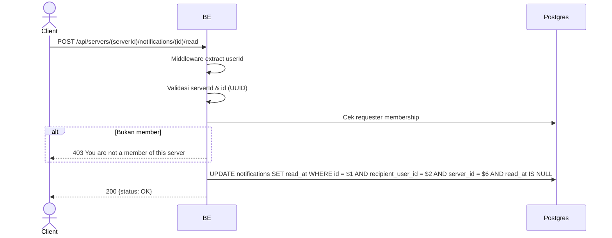

## Overview

Menandai satu notifikasi sebagai sudah dibaca (read). Nested di bawah server (per-server). Requester wajib member, dan notifikasi harus milik requester di server tsb.

---

## Auth

API protected — perlu header `Bearer <accessToken>`.

## Flow



---

## Notes Redis

Tidak pakai Redis.

---

## Notes Postgres/DB

| Tabel            | Kolom                                 | Aksi   | Keterangan                                         |
| ---------------- | ------------------------------------- | ------ | -------------------------------------------------- |
| `server_members` | (count)                               | SELECT | Cek requester membership                           |
| `notifications`  | id, recipient_user_id, server_id      | UPDATE | Set read_at; scoped recipient + server, guard NULL |

---

## Prerequisites

Requester adalah member server, notifikasi milik requester.

---

## Validasi Request

| Field      | Tipe   | Wajib | Aturan         |
| ---------- | ------ | ----- | -------------- |
| `serverId` | string | ya    | Required, UUID |
| `id`       | string | ya    | Required, UUID |

---

## Response

### 200 OK

```json
{ "status": "OK" }
```

### 400 Bad Request

UUID invalid (serverId / id).

### 403 Forbidden

| `error_message`                       | Penyebab               |
| ------------------------------------- | ---------------------- |
| `You are not a member of this server` | Requester bukan member |

### 401 Unauthorized

Standard auth errors.

---

## Update

Dokumentasi ini dibuat tanggal 1 Juni 2026 (notifikasi per-server).
