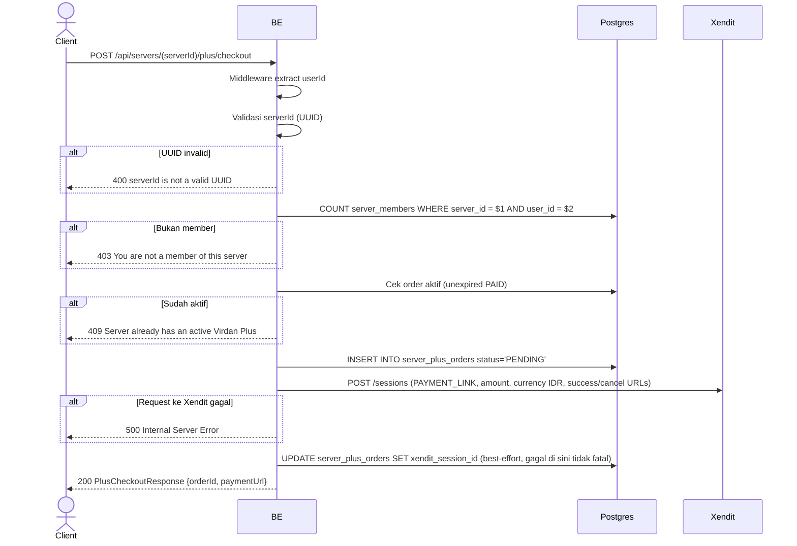

## Overview

API ini memulai pembelian Virdan Plus untuk sebuah server: membuat row order berstatus `PENDING` dan membuka sesi pembayaran hosted di Xendit, lalu mengembalikan link pembayaran yang harus di-redirect ke user oleh client. Order baru ditandai `PAID` belakangan, secara asynchronous, ketika Xendit memanggil webhook (lihat `xendit_webhook.md`) setelah user benar-benar menyelesaikan pembayaran.

---

## Auth

API ini adalah api protected jadi perlu authorization header `Bearer <accessToken>`.

## Flow



---

## Notes Redis

Tidak pakai Redis.

---

## Notes Postgres/DB

| Tabel                 | Kolom                                                     | Aksi   | Keterangan                                                       |
| --------------------- | ----------------------------------------------------------- | ------ | -------------------------------------------------------------------- |
| `server_members`      | (count)                                                       | SELECT | Cek membership                                                        |
| `server_plus_orders`  | plus_expires_at                                               | SELECT | Reject kalau server sudah punya langganan aktif                        |
| `server_plus_orders`  | id, server_id, user_id, reference_id, base/tax/total_idr, status | INSERT | Order baru, `status='PENDING'`, `reference_id = "virdan-plus-{orderId}"` |
| `server_plus_orders`  | xendit_session_id                                             | UPDATE | Attach session id Xendit setelah dibuat (best-effort; kalau gagal request tetap dianggap sukses) |

---

## Notes External API (Xendit)

- `POST {XENDIT_API_BASE_URL}/sessions`, Basic Auth dengan `XENDIT_SECRET_KEY`.
- Body: `session_type: "PAY"`, `mode: "PAYMENT_LINK"`, `amount`, `currency: "IDR"`, `country: "ID"`, `success_return_url`, `cancel_return_url`, `description: "Virdan Plus (30 days)"`.
- Response yang dipakai: `payment_session_id` (disimpan sebagai `xendit_session_id`) dan `payment_link_url` (dikembalikan ke client sebagai `paymentUrl`).

---

## Prerequisites

Caller harus member server yang dituju, dan server tersebut belum punya langganan Virdan Plus yang aktif.

---

## Validasi Request

Path parameter:

| Field      | Tipe   | Wajib | Aturan          |
| ---------- | ------ | ----- | --------------- |
| `serverId` | string | ya    | Required, UUID  |

Tidak ada body.

---

## Response

### 200 OK

```json
{
  "orderId": "order-uuid",
  "paymentUrl": "https://checkout.xendit.co/..."
}
```

| Field        | Tipe   | Deskripsi                                     |
| ------------ | ------ | ------------------------------------------------ |
| `orderId`    | string | UUID order yang baru dibuat                       |
| `paymentUrl` | string | Link pembayaran hosted Xendit untuk di-redirect ke user |

### 400 Bad Request

| `error_message`                | Penyebab     |
| ------------------------------- | ------------ |
| `serverId is not a valid UUID`  | UUID invalid  |

### 403 Forbidden

| `error_message`                        | Penyebab     |
| ---------------------------------------- | ------------ |
| `You are not a member of this server`    | Bukan member  |

### 409 Conflict

| `error_message`                              | Penyebab                                     |
| ----------------------------------------------- | ------------------------------------------------ |
| `Server already has an active Virdan Plus`      | Server sudah punya order `PAID` yang belum expire  |

### 401 Unauthorized

Standard auth errors.

### 500 Internal Server Error

Dikembalikan kalau panggilan ke API session Xendit gagal (network error, response non-2xx, atau response tidak lengkap tanpa `payment_link_url`). Row order `PENDING` yang sudah dibuat sebelum panggilan ini **tidak** di-rollback — order `PENDING` yang nyangkut tanpa session id memang tidak akan pernah jadi `PAID` karena tidak ada webhook yang akan mereferensikannya.

---

## Update

Dokumentasi ini diupdate tanggal 20 Juli 2026.
