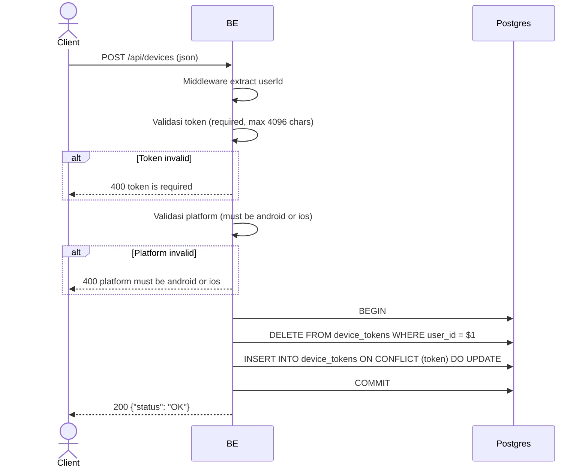

## Overview

API ini digunakan untuk mendaftarkan FCM device token setelah login atau signup selesai. Token disimpan di tabel `device_tokens` dan dipakai untuk mengirim push notification ke device user. Satu user hanya boleh punya 1 token aktif — token lama dihapus setiap kali register ulang.

---

## Auth

API ini adalah api protected jadi perlu authorization header `Bearer <accessToken>`.

---

## Flow



---

## Notes Postgres/DB

| Tabel           | Kolom                                              | Aksi          | Keterangan                              |
| --------------- | -------------------------------------------------- | ------------- | --------------------------------------- |
| `device_tokens` | user_id                                            | DELETE        | Hapus semua token lama milik user       |
| `device_tokens` | id, user_id, token, platform, created_at, ...      | INSERT/UPSERT | Simpan token baru, reassign jika konflik |

---

## Validasi Request

Body JSON:

| Field      | Tipe   | Wajib | Aturan                          |
| ---------- | ------ | ----- | ------------------------------- |
| `token`    | string | ya    | Required, max 4096 karakter     |
| `platform` | string | ya    | Harus `android` atau `ios`      |

---

## Response

### 200 OK

```json
{
  "status": "OK"
}
```

### 400 Bad Request

| `error_message`                    | Penyebab                        |
| ---------------------------------- | ------------------------------- |
| `token is required`                | Token kosong                    |
| `token must be at most 4096 characters` | Token terlalu panjang      |
| `platform must be android or ios`  | Platform tidak valid            |

### 401 Unauthorized

Standard auth errors.

---

## Update

Dokumentasi ini diupdate tanggal 30 Mei 2026.
