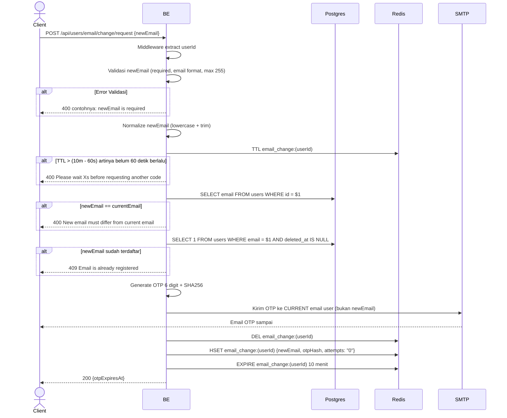

## Overview

API ini digunakan untuk request ganti email. Backend kirim OTP ke email **lama** (current email) — bukan ke email baru — untuk mencegah attacker yang punya password ambil-alih akun dengan ganti email.

Rate limit: hanya boleh request baru kalau session lama sudah lewat cooldown 60 detik (TTL 10 menit, jadi tunggu setelah 9 menit baru bisa request lagi). Max 5 attempts dalam 1 session.

---

## Auth

API ini adalah api protected jadi perlu authorization header `Bearer <accessToken>`.

## Flow



---

## Notes Redis

1. email change session:
   key: `email_change:(userId)`
   type: HASH
   ttl: 10 menit
   fields:
   - `newEmail`
   - `otpHash` (SHA256)
   - `attempts` = "0"

   `DEL` dijalankan dulu sebelum `HSET`/`EXPIRE` (lewat pipeline di `SetEmailChangeSession`) supaya session lama benar-benar bersih sebelum ditulis ulang.

---

## Notes Postgres/DB

| Tabel   | Kolom | Aksi   | Keterangan                                                  |
| ------- | ----- | ------ | ----------------------------------------------------------- |
| `users` | email | SELECT | Ambil current email user buat dibandingkan & dikirimi OTP   |
| `users` | email | SELECT | Cek apakah newEmail sudah dipakai user lain (unique check)  |

---

## Prerequisites

User sudah login dengan access token valid.

---

## Validasi Request

| Field      | Tipe   | Wajib | Aturan                                                       |
| ---------- | ------ | ----- | ------------------------------------------------------------ |
| `newEmail` | string | ya    | Required, format email valid, max 255, beda dari current email |

---

## Response

### 200 OK

```json
{
  "otpExpiresAt": 1714829400
}
```

| Field          | Tipe  | Deskripsi                                          |
| -------------- | ----- | -------------------------------------------------- |
| `otpExpiresAt` | int64 | Unix timestamp expiry OTP (10 menit dari sekarang) |

### 400 Bad Request

| `error_message`                                  | Penyebab                                            |
| ------------------------------------------------ | --------------------------------------------------- |
| `newEmail is required`                           | newEmail kosong                                     |
| `newEmail must be a valid email address`         | Format email tidak valid                            |
| `newEmail must be at most 255 characters`        | Email lebih dari 255 karakter                       |
| `Please wait Xs before requesting another code`  | Cooldown 60 detik belum lewat                        |
| `New email must differ from current email`       | newEmail sama dengan current email                  |

### 409 Conflict

| `error_message`                | Penyebab                                          |
| ------------------------------ | ------------------------------------------------- |
| `Email is already registered`  | newEmail sudah dipakai user lain                  |

### 401 Unauthorized

| `error_message`                              | Penyebab           |
| -------------------------------------------- | ------------------ |
| `Authorization header is missing`            | Header tidak ada    |
| `Authentication token is invalid`            | JWT invalid        |

---

## Update

Dokumentasi ini diupdate tanggal 20 Juli 2026.
