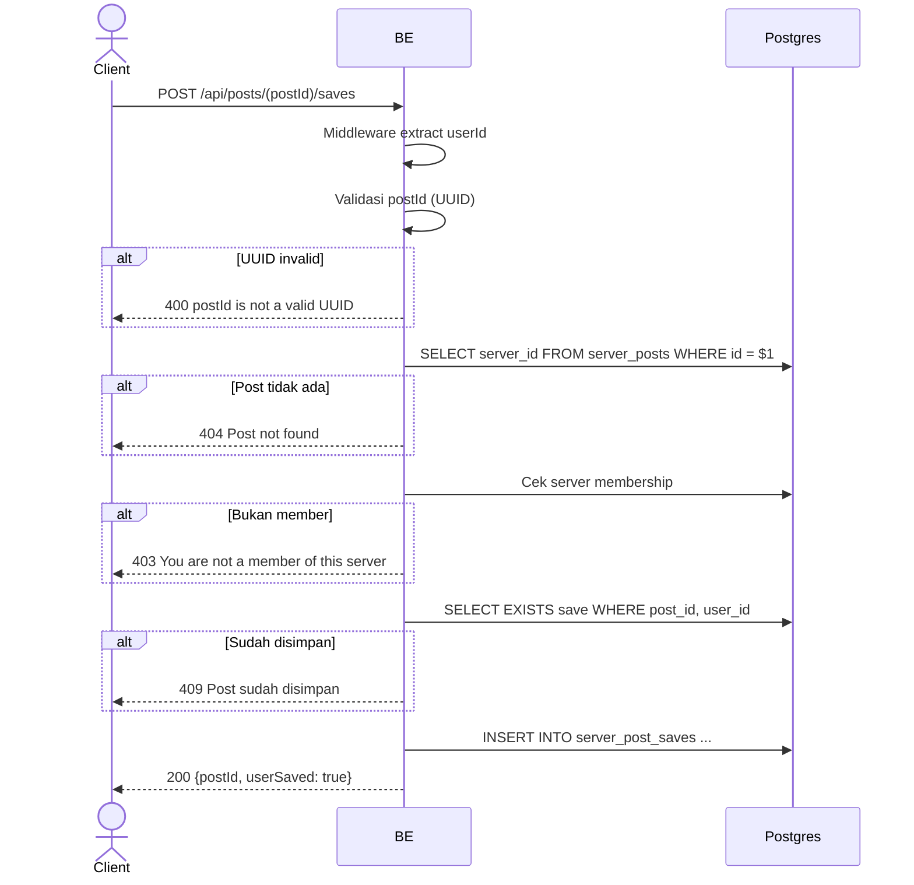

## Overview

API ini digunakan untuk save (bookmark) post ke daftar simpanan pribadi user. Save bersifat privat, per-server, dan tidak mengirim notifikasi ke pemilik post. Kalau post sudah disimpan sebelumnya, return `409 Post sudah disimpan` (validasi eksplisit, bukan idempotent). Return `userSaved: true`.

---

## Auth

API ini adalah api protected jadi perlu authorization header `Bearer <accessToken>`.

## Flow



---

## Notes Redis

Tidak pakai Redis.

---

## Notes Postgres/DB

| Tabel                | Kolom                                  | Aksi   | Keterangan                                          |
| -------------------- | -------------------------------------- | ------ | --------------------------------------------------- |
| `server_posts`       | server_id                              | SELECT | Ambil server_id buat membership check                |
| `server_members`     | (count)                                | SELECT | Cek membership                                      |
| `server_post_saves`  | (exists)                               | SELECT | Cek apakah sudah disimpan (tolak duplikat)           |
| `server_post_saves`  | id, post_id, user_id, created_at, ... | INSERT | Insert save baru. Unique index (post_id, user_id) sebagai jaring pengaman |

---

## Prerequisites

User adalah member server tempat post berada.

---

## Validasi Request

Path parameter:

| Field    | Tipe   | Wajib | Aturan          |
| -------- | ------ | ----- | --------------- |
| `postId` | string | ya    | Required, UUID  |

Tidak ada body.

---

## Response

### 200 OK

```json
{
  "postId": "post-uuid",
  "userSaved": true
}
```

| Field       | Tipe   | Deskripsi                                       |
| ----------- | ------ | ----------------------------------------------- |
| `postId`    | string | UUID post                                       |
| `userSaved` | bool   | Selalu `true` setelah endpoint ini sukses        |

### 400 Bad Request

| `error_message`               | Penyebab     |
| ----------------------------- | ------------ |
| `postId is not a valid UUID`  | UUID invalid  |

### 403 Forbidden

| `error_message`                          | Penyebab     |
| ---------------------------------------- | ------------ |
| `You are not a member of this server`    | Bukan member  |

### 404 Not Found

| `error_message`     | Penyebab            |
| ------------------- | ------------------- |
| `Post not found`    | Post tidak ada       |

### 409 Conflict

| `error_message`        | Penyebab               |
| ---------------------- | ---------------------- |
| `Post sudah disimpan`  | Post sudah pernah di-save |

### 401 Unauthorized

Standard auth errors.

---

## Update

Dokumentasi ini diupdate tanggal 2 Juni 2026.
