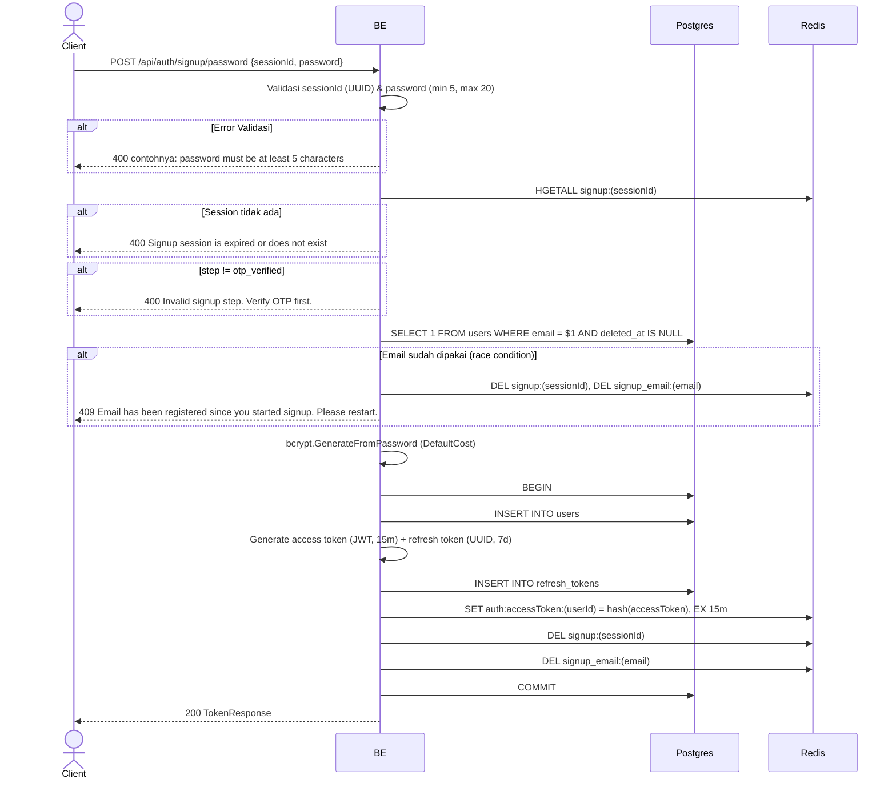

## Overview

API ini digunakan untuk menyelesaikan proses signup dengan menetapkan password. Backend akan membuat user baru, generate token pair, simpan refresh token di Postgres, dan set access token di Redis. Hanya bisa dipanggil setelah OTP sudah diverifikasi.

---

## Auth

API ini adalah api public jadi tidak perlu authorization header. Tapi butuh `sessionId` yang sudah pada step `otp_verified`.

## Flow



---

## Notes Redis

1. signup session:
   key: `signup:(sessionId)`
   aksi: HGETALL (read), DEL (cleanup)

2. signup email session:
   key: `signup_email:(email)`
   aksi: DEL (cleanup)

3. auth access token:
   key: `auth:accessToken:(userId)`
   value: SHA256 hash dari access token
   ttl: 15 menit

---

## Notes Postgres/DB

| Tabel            | Kolom        | Aksi   | Keterangan                                            |
| ---------------- | ------------ | ------ | ----------------------------------------------------- |
| `users`          | email        | SELECT | Cek email belum di-claim user lain (race protection)  |
| `users`          | id           | INSERT | UUID user baru                                        |
| `users`          | email        | INSERT | Email dari session signup                             |
| `users`          | password     | INSERT | bcrypt hash dari password                             |
| `users`          | settings     | INSERT | Default `{"notif_like":true,"notif_comment":true,"notif_reply":true}` |
| `users`          | created_at   | INSERT | UTC now                                               |
| `users`          | updated_at   | INSERT | UTC now                                               |
| `users`          | created_by   | INSERT | userId (self)                                         |
| `users`          | updated_by   | INSERT | userId (self)                                         |
| `refresh_tokens` | id           | INSERT | UUID baru                                             |
| `refresh_tokens` | user_id      | INSERT | userId baru                                           |
| `refresh_tokens` | token_hash   | INSERT | SHA256 hash dari refresh token                        |
| `refresh_tokens` | token_family | INSERT | UUID baru (per device family)                         |
| `refresh_tokens` | expires_at   | INSERT | now + 7 hari                                          |
| `refresh_tokens` | created_at   | INSERT | UTC now                                               |
| `refresh_tokens` | updated_at   | INSERT | UTC now                                               |
| `refresh_tokens` | created_by   | INSERT | userId                                                |
| `refresh_tokens` | updated_by   | INSERT | userId                                                |

---

## Prerequisites

User sudah hit `start_signup` dan `verify_otp` sehingga step session = `otp_verified`. Session belum expired (TTL Redis 30 menit).

---

## Validasi Request

| Field       | Tipe   | Wajib | Aturan                                            |
| ----------- | ------ | ----- | ------------------------------------------------- |
| `sessionId` | string | ya    | Required, harus UUID valid                        |
| `password`  | string | ya    | Required, min 5 karakter, max 20 karakter         |

---

## Response

### 200 OK

```json
{
  "accessToken": "eyJhbGciOiJIUzI1NiIsInR5cCI6IkpXVCJ9...",
  "accessTokenExpiresIn": 900,
  "refreshToken": "550e8400-e29b-41d4-a716-446655440000",
  "refreshTokenExpiresIn": 604800,
  "tokenType": "Bearer"
}
```

| Field                   | Tipe   | Deskripsi                                          |
| ----------------------- | ------ | -------------------------------------------------- |
| `accessToken`           | string | JWT access token                                   |
| `accessTokenExpiresIn`  | int    | TTL access token dalam detik (900 = 15 menit)      |
| `refreshToken`          | string | UUID refresh token                                 |
| `refreshTokenExpiresIn` | int    | TTL refresh token dalam detik (604800 = 7 hari)    |
| `tokenType`             | string | Selalu "Bearer"                                    |

### 400 Bad Request

| `error_message`                                | Penyebab                                  |
| ---------------------------------------------- | ----------------------------------------- |
| `sessionId is required`                        | sessionId kosong                          |
| `sessionId is not a valid UUID`                | Format sessionId bukan UUID               |
| `password is required`                         | Password kosong                           |
| `password must be at least 5 characters`       | Password kurang dari 5 karakter           |
| `password must be at most 20 characters`       | Password lebih dari 20 karakter           |
| `Signup session is expired or does not exist`  | Session sudah tidak ada di Redis          |
| `Invalid signup step. Verify OTP first.`       | Step session belum `otp_verified`         |

### 409 Conflict

| `error_message`                                                       | Penyebab                                                                                                  |
| --------------------------------------------------------------------- | --------------------------------------------------------------------------------------------------------- |
| `Email has been registered since you started signup. Please restart.` | `CheckEmailUnique` di usecase return `true` (email dipakai user lain antara start_signup dan set_password) |
| `Email already exists`                                                | Race condition: `INSERT INTO users` collide unique index email → repository Register catch `23505`           |

---

## Update

Dokumentasi ini diupdate tanggal 20 Juli 2026.
