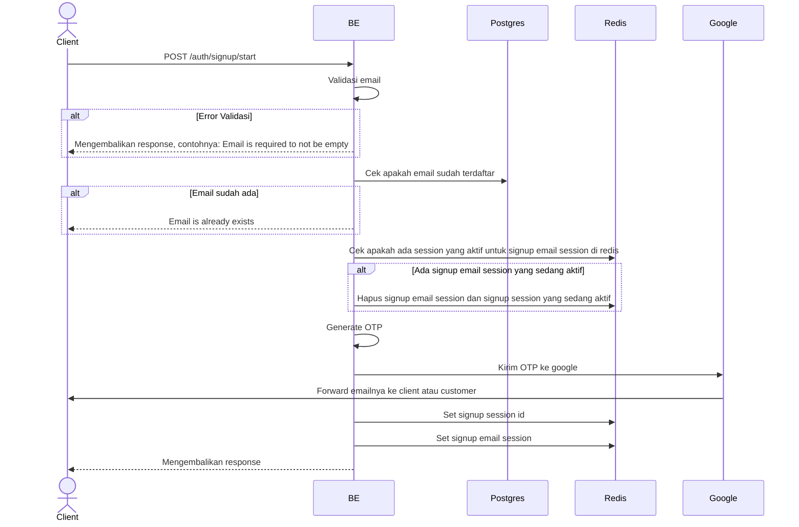

## Overview

Api ini digunakan untuk memulai proses registrasi dari awal.

---

## Auth

API ini adalah api public jadi tidak perlu authorization header

## Flow



---

## Notes Redis

1. Session email session:
   key: signup_email:(email)
   value: sessionId

2. Session signup (HSET):
   key: signup:(sessionId)
   value:
   1. "email"
   2. "user@example.com"
   3. "otp"
   4. "123456"
   5. "otp_expires_at"
   6. "2024-01-15 10:30:00 +0000 UTC"
   7. "step"
   8. "0"
   9. "create_at"
   10. "1705312200"

   atau kalau dicodinganya itu

```go
   err = repository.DBCache.HSet(ctx, key, map[string]interface{}{
   "email": email,
   "otp": otp,
   "otp_expires_at": otpExpiresAt,
   "step": model.SignupStepStart,
   "created_at": time.Now().Unix(),
   }).Err()
```

---

## Notes Postgres/DB

| Tabel   | Kolom | Aksi   | Keterangan                                                   |
| ------- | ----- | ------ | ------------------------------------------------------------ |
| `users` | email | SELECT | Select email menggunakan email dari payload untuk cek unique |

## Prerequisites

Tidak ada, bisa hit api ini pada kondisi apapun misalnya sedang ada sesi register yang aktif atau tidak.

---

## Validasi Request

| Field   | Tipe   | Wajib | Aturan                                                                 |
| ------- | ------ | ----- | ---------------------------------------------------------------------- |
| `email` | string | ya    | Email harus unique, min 16 karakter, max 80, dan formatnya harus email |

## Response

### 200 OK

```json
{
  "session_id": "123e4567-e89b-12d3-a456-426614174000",
  "otp_expires_at": "2025-01-01T12:00:00Z"
}
```

### 400 Bad Request

| `error_message`                        | Penyebab                      |
| -------------------------------------- | ----------------------------- |
| `Email is required to not be empty`    | Email tidak diisi             |
| `Email must be at least 16 characters` | Email kurang dari 16 karakter |
| `Email must be at most 80 characters`  | Email lebih dari 80 karakter  |
| `Email must be a valid email address`  | Email tidak valid             |
| `Email is already registered`          | Email sudah terdaftar         |

## Update

Dokumentasi ini diupdate tanggal 20 April 2026.
