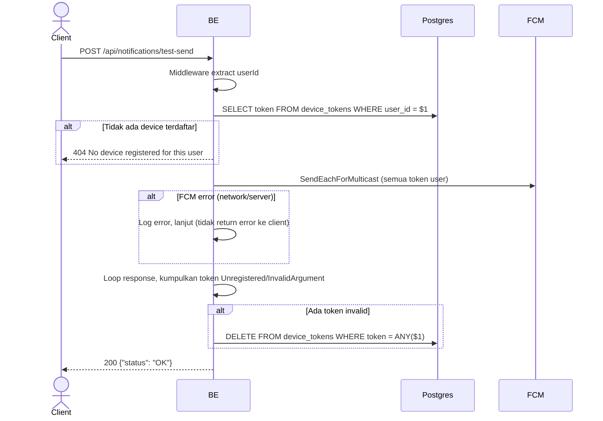

## Overview

API ini digunakan untuk mengirim test push notification ke semua device yang terdaftar milik user yang sedang login. Berguna untuk memverifikasi bahwa pipa FCM berjalan end-to-end. Token FCM yang sudah tidak valid (unregistered/invalid) dibersihkan otomatis setelah pengiriman.

---

## Auth

API ini adalah api protected jadi perlu authorization header `Bearer <accessToken>`.

---

## Flow



---

## Notes Postgres/DB

| Tabel           | Kolom  | Aksi   | Keterangan                                         |
| --------------- | ------ | ------ | -------------------------------------------------- |
| `device_tokens` | token  | SELECT | Ambil semua token milik user                       |
| `device_tokens` | token  | DELETE | Hapus token invalid setelah FCM response (cleanup) |

---

## Notes FCM

- Menggunakan `SendEachForMulticast` — 1 HTTP call ke FCM untuk semua device user.
- Payload: `notification{Title:"Virdan", Body:"Test notification berhasil."}` + `data{type:"test"}`.
- Priority Android: `high`.
- Kegagalan FCM (network error, server error) tidak dikembalikan sebagai error ke client — hanya di-log.

---

## Response

### 200 OK

```json
{
  "status": "OK"
}
```

### 404 Not Found

| `error_message`                        | Penyebab                          |
| -------------------------------------- | --------------------------------- |
| `No device registered for this user`   | User belum pernah register device |

### 401 Unauthorized

Standard auth errors.

---

## Update

Dokumentasi ini diupdate tanggal 30 Mei 2026.
