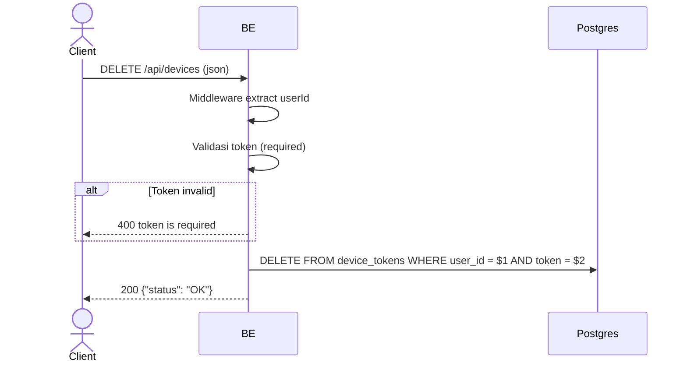

## Overview

API ini digunakan untuk menghapus FCM device token saat user logout. Token dihapus dari tabel `device_tokens` sehingga device tidak lagi menerima push notification setelah logout. Token yang dihapus harus milik user yang sedang login (scoped ke owner).

---

## Auth

API ini adalah api protected jadi perlu authorization header `Bearer <accessToken>`.

---

## Flow



---

## Notes Postgres/DB

| Tabel           | Kolom              | Aksi   | Keterangan                                       |
| --------------- | ------------------ | ------ | ------------------------------------------------ |
| `device_tokens` | user_id, token     | DELETE | Hapus token spesifik milik user (scoped ke owner) |

---

## Validasi Request

Body JSON:

| Field   | Tipe   | Wajib | Aturan   |
| ------- | ------ | ----- | -------- |
| `token` | string | ya    | Required |

---

## Response

### 200 OK

```json
{
  "status": "OK"
}
```

Response 200 juga dikembalikan jika token tidak ditemukan (DELETE 0 rows) — ini intentional agar logout selalu sukses.

### 400 Bad Request

| `error_message`     | Penyebab      |
| ------------------- | ------------- |
| `token is required` | Token kosong  |

### 401 Unauthorized

Standard auth errors.

---

## Update

Dokumentasi ini diupdate tanggal 30 Mei 2026.
