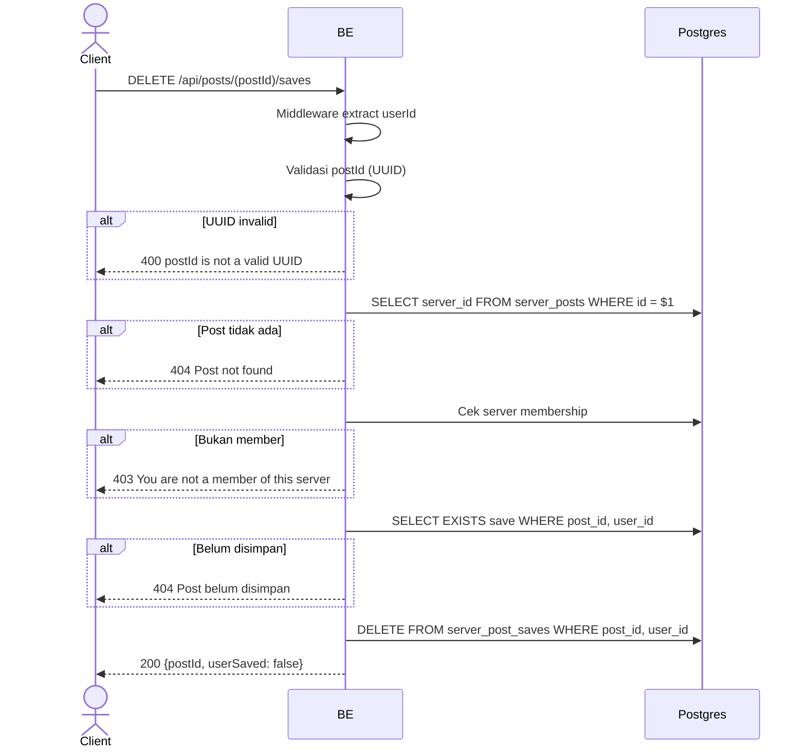

## Overview

API ini digunakan untuk unsave (hapus bookmark) post dari daftar simpanan pribadi user. Kalau post belum pernah disimpan, return `404 Post belum disimpan`. Return `userSaved: false`.

---

## Auth

API ini adalah api protected jadi perlu authorization header `Bearer <accessToken>`.

## Flow



---

## Notes Redis

Tidak pakai Redis.

---

## Notes Postgres/DB

| Tabel                | Kolom                  | Aksi   | Keterangan                                          |
| -------------------- | ---------------------- | ------ | --------------------------------------------------- |
| `server_posts`       | server_id              | SELECT | Ambil server_id buat membership check                |
| `server_members`     | (count)                | SELECT | Cek membership                                      |
| `server_post_saves`  | (exists)               | SELECT | Cek apakah memang sudah disimpan                     |
| `server_post_saves`  | post_id, user_id       | DELETE | Hapus save                                          |

---

## Prerequisites

User adalah member server tempat post berada dan post sudah pernah disimpan.

---

## Validasi Request

Path parameter:

| Field    | Tipe   | Wajib | Aturan          |
| -------- | ------ | ----- | --------------- |
| `postId` | string | ya    | Required, UUID  |

Tidak ada body.

---

## Response

### 200 OK

```json
{
  "postId": "post-uuid",
  "userSaved": false
}
```

| Field       | Tipe   | Deskripsi                                       |
| ----------- | ------ | ----------------------------------------------- |
| `postId`    | string | UUID post                                       |
| `userSaved` | bool   | Selalu `false` setelah endpoint ini sukses       |

### 400 Bad Request

| `error_message`               | Penyebab     |
| ----------------------------- | ------------ |
| `postId is not a valid UUID`  | UUID invalid  |

### 403 Forbidden

| `error_message`                          | Penyebab     |
| ---------------------------------------- | ------------ |
| `You are not a member of this server`    | Bukan member  |

### 404 Not Found

| `error_message`        | Penyebab               |
| ---------------------- | ---------------------- |
| `Post not found`       | Post tidak ada          |
| `Post belum disimpan`  | Post belum pernah di-save |

### 401 Unauthorized

Standard auth errors.

---

## Update

Dokumentasi ini diupdate tanggal 2 Juni 2026.
