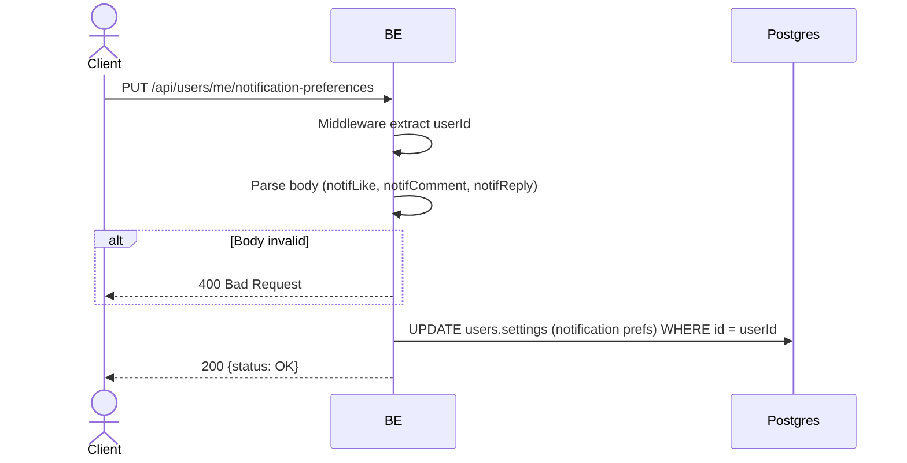

## Overview

API ini mengupdate preferensi notifikasi push milik user (per-type: like, comment, reply). Mengikuti model IG: row notifikasi tetap selalu dibuat (feed = arsip lengkap), preferensi ini HANYA menggerbang apakah push dikirim ke device, bukan keberadaan row di feed.

---

## Auth

API ini adalah api protected jadi perlu authorization header `Bearer <accessToken>`.

## Flow



---

## Notes Redis

Tidak pakai Redis.

---

## Notes Postgres/DB

| Tabel   | Kolom                          | Aksi   | Keterangan                                  |
| ------- | ------------------------------ | ------ | ------------------------------------------- |
| `users` | settings (notification prefs)  | UPDATE | Simpan toggle push per-type milik user      |

---

## Prerequisites

User sudah login (punya access token valid).

---

## Validasi Request

Body (JSON):

Tidak ada validasi field-level di service (tidak ada pengecekan `shared.NewValidator()`) — field yang tidak dikirim di body JSON otomatis default ke `false`, bukan memicu 400.

| Field          | Tipe | Wajib | Aturan                              |
| -------------- | ---- | ----- | ------------------------------------ |
| `notifLike`    | bool | tidak | true/false, default false bila tidak dikirim |
| `notifComment` | bool | tidak | true/false, default false bila tidak dikirim |
| `notifReply`   | bool | tidak | true/false, default false bila tidak dikirim |

---

## Response

### 200 OK

```json
{
  "status": "OK"
}
```

| Field    | Tipe   | Deskripsi              |
| -------- | ------ | ---------------------- |
| `status` | string | Selalu `OK` saat sukses |

### 400 Bad Request

| `error_message`                        | Penyebab                                             |
| --------------------------------------- | ----------------------------------------------------- |
| `The request is invalid or malformed`  | Body JSON malformed (misalnya sebuah field bukan boolean) |

### 401 Unauthorized

Standard auth errors.

---

## Update

Dokumentasi ini diupdate tanggal 20 Juli 2026.
