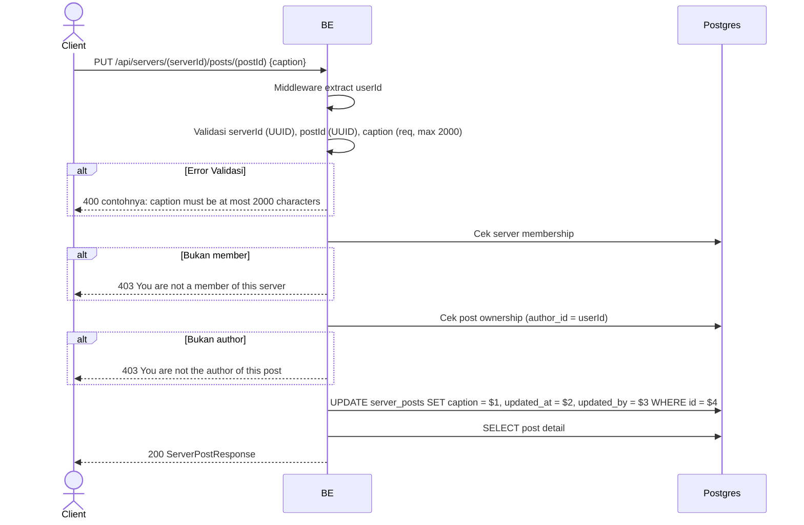

## Overview

API ini digunakan untuk update caption post. Image tidak bisa diubah. Hanya author post yang boleh edit.

---

## Auth

API ini adalah api protected jadi perlu authorization header `Bearer <accessToken>`.

## Flow



---

## Notes Redis

Tidak pakai Redis.

---

## Notes Postgres/DB

| Tabel            | Kolom              | Aksi   | Keterangan          |
| ---------------- | ------------------ | ------ | ------------------- |
| `server_members` | (count)            | SELECT | Cek membership      |
| `server_posts`   | author_id          | SELECT | Cek ownership       |
| `server_posts`   | caption            | UPDATE | Update caption       |
| `server_posts`   | updated_at         | UPDATE | UTC now              |
| `server_posts`   | updated_by         | UPDATE | userId               |

---

## Prerequisites

User adalah member server dan author post.

---

## Validasi Request

Path parameter:

| Field      | Tipe   | Wajib | Aturan          |
| ---------- | ------ | ----- | --------------- |
| `serverId` | string | ya    | Required, UUID  |
| `postId`   | string | ya    | Required, UUID  |

Body JSON:

| Field     | Tipe   | Wajib | Aturan                       |
| --------- | ------ | ----- | ---------------------------- |
| `caption` | string | ya    | Required, max 2000 karakter  |

---

## Response

### 200 OK

```json
{
  "id": "post-uuid",
  "serverId": "server-uuid",
  "caption": "Caption baru",
  "imageUrl": "http://.../webp",
  "mediaType": "image",
  "author": { "userId": "...", "nickname": "...", "username": "...", "avatarUrl": null, "status": "active" },
  "likeCount": 5,
  "commentCount": 2,
  "userLiked": false,
  "userSaved": false,
  "isOwner": true,
  "createdAt": "2026-05-23T08:00:00Z",
  "updatedAt": "2026-05-23T10:00:00Z"
}
```

Catatan: post detail juga menyertakan `videoUrl`, `thumbnailUrl`, `mediaWidth`, `mediaHeight`, dan `mirrored` kalau media post-nya adalah video (lihat `create_post.md`).

### 400 Bad Request

| `error_message`                              | Penyebab                       |
| -------------------------------------------- | ------------------------------ |
| `serverId is not a valid UUID`               | serverId invalid                |
| `postId is not a valid UUID`                 | postId invalid                  |
| `caption is required`                        | Caption kosong                  |
| `caption must be at most 2000 characters`    | Terlalu panjang                 |

### 403 Forbidden

| `error_message`                          | Penyebab                |
| ---------------------------------------- | ----------------------- |
| `You are not a member of this server`    | User bukan member       |
| `You are not the author of this post`    | User bukan author post   |

### 401 Unauthorized

Standard auth errors.

---

## Update

Dokumentasi ini diupdate tanggal 20 Juli 2026.
