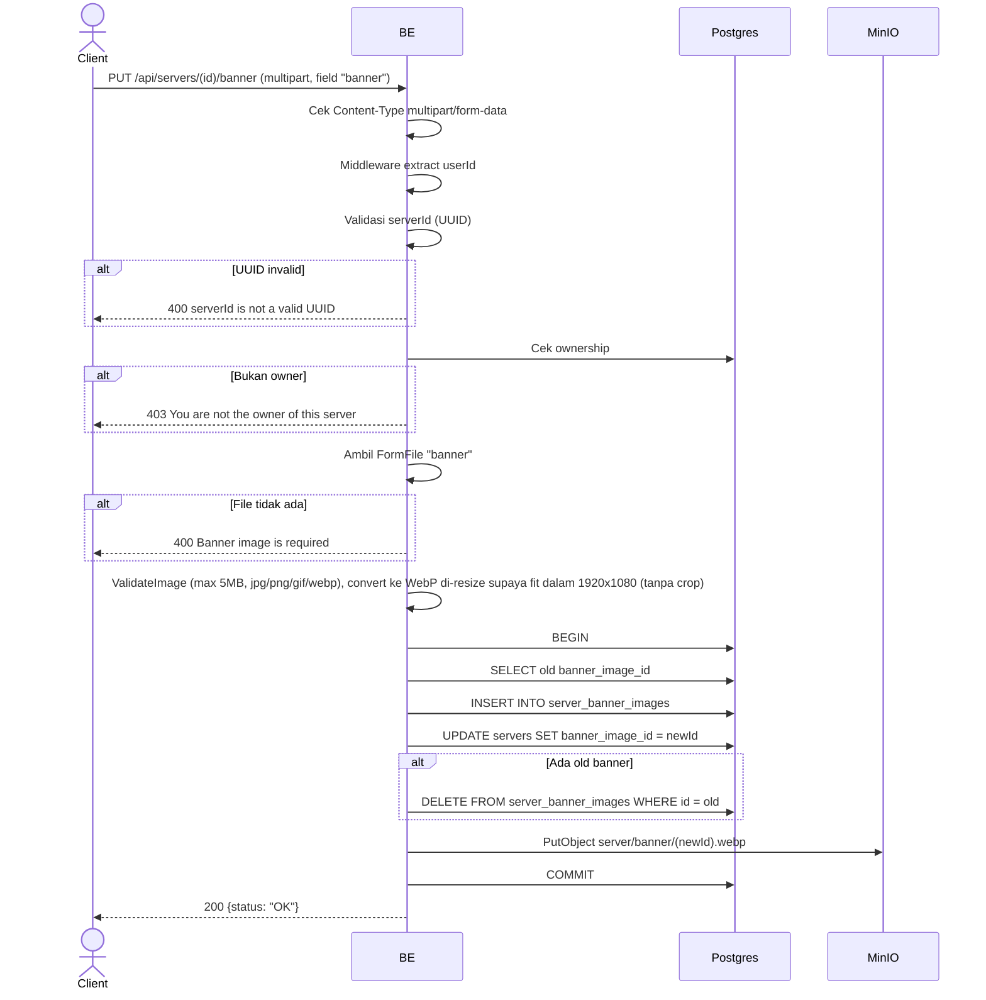

## Overview

API ini digunakan untuk update banner server. Format multipart, validate image, convert ke WebP, upload ke MinIO, replace banner lama. Hanya owner yang boleh.

---

## Auth

API ini adalah api protected jadi perlu authorization header `Bearer <accessToken>`.

## Flow



---

## Notes Redis

Tidak pakai Redis.

---

## Notes MinIO

- Bucket: `MINIO_BUCKET_NAME` (default `virdan`)
- Object key: `server/banner/{newImageId}.webp`
- Content-Type: `image/webp`
- Aksi: PutObject

---

## Notes Postgres/DB

| Tabel                  | Kolom                                              | Aksi   | Keterangan                  |
| ---------------------- | -------------------------------------------------- | ------ | --------------------------- |
| `servers`              | owner_id                                           | SELECT | Cek ownership               |
| `servers`              | banner_image_id                                    | SELECT | Ambil banner lama            |
| `server_banner_images` | id, bucket, object_key, mime_type, size, ...       | INSERT | Row image baru               |
| `servers`              | banner_image_id, updated_at, updated_by            | UPDATE | Set banner baru              |
| `server_banner_images` | id                                                 | DELETE | Hapus image lama             |

---

## Prerequisites

User adalah owner server. Punya file image valid.

---

## Validasi Request

Format: `multipart/form-data`.

| Field        | Tipe   | Wajib | Aturan                                  |
| ------------ | ------ | ----- | --------------------------------------- |
| `id` (path)  | string | ya    | Required, UUID                           |
| `banner`     | file   | ya    | Image (jpg/jpeg/png/gif/webp), max 5MB, di-resize supaya fit dalam 1920x1080 (tanpa crop) |

---

## Response

### 200 OK

```json
{
  "status": "OK"
}
```

### 400 Bad Request

| `error_message`                                                       | Penyebab                       |
| --------------------------------------------------------------------- | ------------------------------ |
| `Invalid Content-Type header. Endpoint requires multipart/form-data.` | Content-Type bukan multipart   |
| `serverId is not a valid UUID`                                        | UUID invalid                    |
| `Banner image is required`                                            | File banner tidak ada           |
| `image size exceeded 5MB limit`                                       | File terlalu besar              |
| `invalid file extension: ...`                                         | Ekstensi tidak diizinkan        |
| `invalid image type: ...`                                             | MIME type tidak diizinkan       |

### 403 Forbidden

| `error_message`                          | Penyebab     |
| ---------------------------------------- | ------------ |
| `You are not the owner of this server`   | Bukan owner   |

### 401 Unauthorized

Standard auth errors.

---

## Update

Dokumentasi ini diupdate tanggal 20 Juli 2026.
