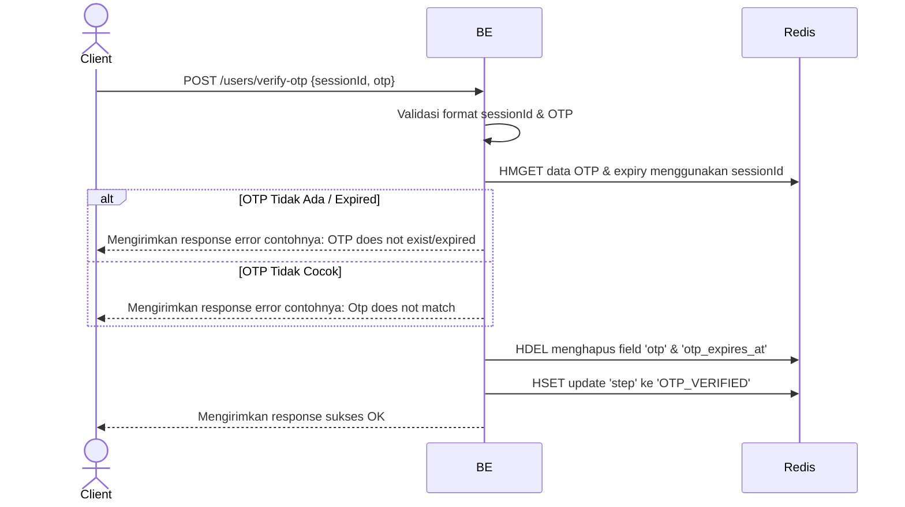

## Overview

Api ini digunakan untuk memverifikasi kode OTP yang dikirimkan user verifikasi otp setelah proses sebelumnya itu input email atau api start signup. Backend akan melakukan pengecekan expiry dan kecocokan hash OTP di Redis. Jika valid, "state" di dalam signup sesion akan diperbarui menjadi `OTP_VERIFIED`.

---

## Auth

API ini bersifat publik (tidak memerlukan Authorization header), namun membutuhkan `sessionId` yang valid dari tahap signup sebelumnya.

## Flow



---

## Notes Redis

1. signup session:
   key: `signup:(sessionId)`

| Field             | Tipe   | Aksi | Keterangan                                   |
| ----------------- | ------ | ---- | -------------------------------------------- |
| `otp`             | string | HDEL | Kode OTP (hashed) dihapus setelah verifikasi |
| `otp_expires_at`  | string | HDEL | Timestamp expiry dihapus setelah verifikasi  |
| `step`            | string | HSET | Diperbarui menjadi `OTP_VERIFIED`            |
| `otp_verified_at` | string | HSET | Menyimpan timestamp waktu verifikasi sukses  |

---

## Prerequisites

User harus sudah melakukan tahap `Start Signup` dan memiliki `sessionId` yang aktif di Redis.

---

## Validasi Request

| Field       | Tipe   | Wajib | Aturan                                |
| ----------- | ------ | ----- | ------------------------------------- |
| `sessionId` | string | Ya    | Harus tepat 36 karakter (UUID format) |
| `otp`       | string | Ya    | Harus tepat 6 karakter                |

---

## Response

### 200 OK

```json
{
  "status": "OK"
}
```

### 400 Bad Request

| `error_message`                          | Penyebab                                                                                                            |
| ---------------------------------------- | ------------------------------------------------------------------------------------------------------------------- |
| `Session id is required to not be empty` | Session id tidak diisi                                                                                              |
| `Session id must exactly 36 characters ` | Session id harus 36 character (formatnya UUID)                                                                      |
| `OTP is required to not be empty`        | OTP tidak diisi                                                                                                     |
| `OTP must be exactly 6 characters`       | OTP tidak valid                                                                                                     |
| `OTP does not exists or expired`         | OTP sudah tidak ada atau sudah expired                                                                              |
| `OTP is expired`                         | OTP sudah expired (untuk jaga jaga saja kalau ternyata expires at nya itu tidak sama dengan ttl tapi harusnya sama) |
| `OTP does not match`                     | OTP tidak match                                                                                                     |

## Update

Dokumentasi ini diupdate tanggal 21 April 2026.
