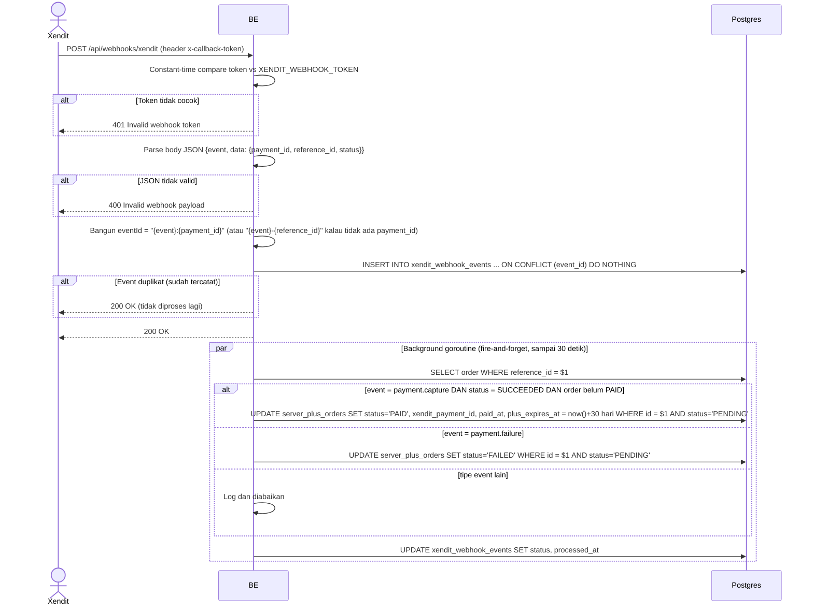

## Overview

API ini adalah webhook callback yang dipanggil Xendit untuk melaporkan event pembayaran (misalnya payment capture yang sukses atau gagal untuk sesi checkout Virdan Plus). Bukan dipanggil oleh client aplikasi sendiri. Request diautentikasi dengan shared secret callback token, bukan access token user, dan update status order sebenarnya terjadi secara asynchronous di background goroutine setelah endpoint ini merespons `200 OK`.

---

## Auth

Ini endpoint **public** (tidak ada `Authorization` bearer token, tidak ada cek membership/ownership). Sebagai gantinya, header `x-callback-token` divalidasi terhadap `XENDIT_WEBHOOK_TOKEN` menggunakan constant-time comparison.

## Flow



---

## Notes Redis

Tidak pakai Redis.

---

## Notes Postgres/DB

| Tabel                    | Kolom                                                            | Aksi   | Keterangan                                                                |
| ------------------------- | ------------------------------------------------------------------------ | ------ | ------------------------------------------------------------------------------- |
| `xendit_webhook_events`  | id, event_id, event_type, reference_id, payload, status, received_at   | INSERT | Guard idempotency, `ON CONFLICT (event_id) DO NOTHING`; delivery duplikat insert 0 row dan pemrosesan di-skip |
| `server_plus_orders`     | (lookup)                                                                  | SELECT | Ambil order berdasarkan `reference_id` (async, di background goroutine)          |
| `server_plus_orders`     | status, xendit_payment_id, paid_at, plus_expires_at                      | UPDATE | Hanya diterapkan `WHERE status = 'PENDING'`, jadi order yang sudah `PAID`/`FAILED` tidak diutak-atik |
| `xendit_webhook_events`  | status, processed_at                                                      | UPDATE | Menandai event `PROCESSED` atau `FAILED` setelah background handler selesai       |

---

## Prerequisites

Caller harus mengirim header `x-callback-token` yang benar (shared secret, dikonfigurasi terpisah dengan Xendit — bukan credential user).

---

## Validasi Request

Header:

| Field              | Wajib | Aturan                                     |
| -------------------- | ----- | -------------------------------------------- |
| `x-callback-token`  | ya    | Harus persis sama dengan `XENDIT_WEBHOOK_TOKEN` (constant-time comparison) |

Body (JSON):

| Field              | Tipe   | Wajib  | Keterangan                                                     |
| -------------------- | ------ | ------ | ------------------------------------------------------------------- |
| `event`              | string | ya     | mis. `payment.capture`, `payment.failure`; nilai lain di-log dan diabaikan |
| `data.payment_id`    | string | tidak  | Payment id dari Xendit; dipakai bareng `event` buat idempotency key   |
| `data.reference_id`  | string | ya*    | Harus cocok dengan `reference_id` yang tersimpan di order (`virdan-plus-{orderId}`) supaya update-nya berhasil ketemu |
| `data.status`        | string | tidak  | Untuk `payment.capture`, harus `SUCCEEDED` supaya order ditandai `PAID` |

\* Tidak divalidasi keberadaannya oleh handler, tapi wajib secara praktik — kalau tidak cocok dengan order manapun, lookup di background gagal dan event ditandai `FAILED` (secara diam-diam, dari sudut pandang Xendit karena response HTTP sudah `200 OK` duluan).

---

## Response

### 200 OK

```json
{ "status": "OK" }
```

Dikembalikan baik untuk event yang baru diterima (pemrosesan terjadi setelahnya, secara asynchronous) maupun untuk delivery duplikat dari event yang sudah tercatat (tidak diproses ulang).

### 400 Bad Request

| `error_message`             | Penyebab                       |
| ------------------------------ | ------------------------------------ |
| `Invalid webhook payload`      | Body bukan JSON yang valid            |

### 401 Unauthorized

| `error_message`           | Penyebab                                        |
| ---------------------------- | ---------------------------------------------------- |
| `Invalid webhook token`      | Header `x-callback-token` hilang atau salah            |

---

## Update

Dokumentasi ini diupdate tanggal 20 Juli 2026.
